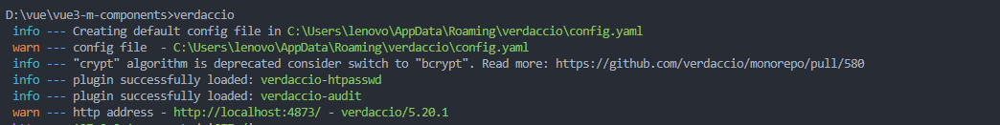

## 安装并启动 verdaccio

全局安装

```shell
npm i -g verdaccio
```

启动

```shell
verdaccio
```

启动成功，终端输出如下




## 发布

在此之前，你需要先[注册 npm 的账号](https://www.npmjs.com/)

- 登录

```shell
npm adduser --registry  http://localhost:4873
```
输入npm账号用户名、密码和邮箱,登录成功后如下：

```shell
Username: vimalakirti
Password: 
Email: (this IS public) 1902644369@qq.com
Logged in as vimalakirti on http://localhost:4873/.
```
进入到本地要发布的仓库

```shell
npm publish --registry http://localhost:4873
```
例如，我发布一个 组件库 m-components

发布成功以后如下：
```shell
npm notice 
npm notice �📦  m-components@1.0.0 
npm notice === Tarball Contents === 
npm notice 2.2kB   build.js
npm notice 162B    calendar/index.d.ts
npm notice 445.9kB calendar/index.es.js
npm notice 220.9kB calendar/index.umd.js
npm notice 121B    calendar/package.json
npm notice 18.2kB  calendar/style.css
npm notice 162B    chooseArea/index.d.ts
npm notice 351.7kB chooseArea/index.es.js
npm notice 162.7kB chooseArea/index.umd.js
npm notice 123B    chooseArea/package.json
npm notice 162B    chooseCity/index.d.ts
npm notice 5.3kB   chooseCity/index.es.js 
npm notice 2.5kB   chooseCity/index.umd.js
npm notice 123B    chooseCity/package.json
npm notice 298B    chooseCity/style.css
npm notice 162B    chooseDate/index.d.ts
npm notice 3.0kB   chooseDate/index.es.js
npm notice 1.7kB   chooseDate/index.umd.js
npm notice 123B    chooseDate/package.json
npm notice 162B    chooseIcon/index.d.ts
npm notice 323.1kB chooseIcon/index.es.js
npm notice 214.0kB chooseIcon/index.umd.js
npm notice 123B    chooseIcon/package.json
npm notice 382B    chooseIcon/style.css
npm notice 162B    chooseTime/index.d.ts
npm notice 3.2kB   chooseTime/index.es.js
npm notice 1.9kB   chooseTime/index.umd.js
npm notice 123B    chooseTime/package.json
npm notice 162B    form/index.d.ts        
npm notice 757.3kB form/index.es.js
npm notice 294.2kB form/index.umd.js
npm notice 117B    form/package.json
npm notice 162B    index.d.ts
npm notice 1.9MB   index.es.js
npm notice 905.8kB index.umd.js
npm notice 162B    menu/index.d.ts
npm notice 301.0kB menu/index.es.js
npm notice 203.8kB menu/index.umd.js
npm notice 117B    menu/package.json
npm notice 158B    menu/style.css
npm notice 162B    modalForm/index.d.ts
npm notice 3.6kB   modalForm/index.es.js
npm notice 2.0kB   modalForm/index.umd.js
npm notice 122B    modalForm/package.json
npm notice 306B    package.json
npm notice 162B    progress/index.d.ts
npm notice 1.2kB   progress/index.es.js
npm notice 866B    progress/index.umd.js
npm notice 121B    progress/package.json
npm notice 19.6kB  style.css
npm notice 162B    table/index.d.ts
npm notice 43.9kB  table/index.es.js
npm notice 17.6kB  table/index.umd.js
npm notice 118B    table/package.json     
npm notice 162B    trend/index.d.ts
npm notice 2.4kB   trend/index.es.js
npm notice 1.5kB   trend/index.umd.js
npm notice 118B    trend/package.json
npm notice 191B    trend/style.css
npm notice 115B    utils/index.es.js
npm notice 400B    utils/index.umd.js
npm notice 118B    utils/package.json
npm notice === Tarball Details ===
npm notice name:          m-components
npm notice version:       1.0.0
npm notice filename:      m-components-1.0.0.tgz
npm notice package size:  1.2 MB
npm notice unpacked size: 6.2 MB
npm notice shasum:        423e5bd126c7afbaf8de588462a70583646d4f02
npm notice integrity:     sha512-GYgzJzEvBZVFX[...]Vclivnow4rQ3w==
npm notice total files:   62
npm notice
npm notice Publishing to http://localhost:4873/
+ m-components@1.0.0
```

## 使用私有仓库npm包

查看npm配置信息

```shell
npm config ls
```

要使用发布到私有仓库的npm包时，需要修改仓库地址

```shell
npm set registry http://localhost:4873
```

在执行这条命令以后，再使用npm install m-components 命令就会优先去我们自己的私有仓库下载npm包，如何没有找到，则会从npm中央仓库下载

>推荐使用 nrm 切换npm仓库地址

[使用verdaccio搭建npm私有仓库](https://juejin.cn/post/6844903776533364749#heading-6)