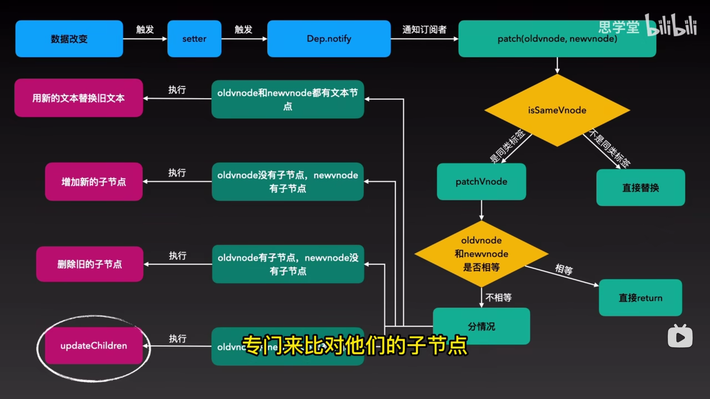

## 父子组件的生命周期

- **加载渲染阶段：** 父beforeCreate => 父created => 父beforeMount => 子beforeCreate => 子created => 子beforeMount => 子 mounted => 父 mounted
- **更新阶段：** 父 beforeUpdate -> 子 beforeUpdate -> 子 updated -> 父 updated
- **销毁阶段：** 父 beforeDestroy -> 子 beforeDestroy -> 子 destroyed -> 父 destroyed

## this.$nextTick 原理（vue2/3）

[this.$nextTick你真的理解了吗？](https://juejin.cn/post/7177681326861418556)


vue2 的初始化过程做了哪些事情？

```js
new Vue走到了vue的构造函数中：`src\core\instance\index.js`文件。
​
this._init(options)
​
然后从Mixin增加的原型方法看，initMixin(Vue)，调用的是为Vue增加的原型方法_init
​
// src/core/instance/init.js
​
function initMixin (Vue) {
  Vue.prototype._init = function (options) {
     var vm = this; 创建vm, 
     ...
     // 合并options 到 vm.$options
     vm.$options = mergeOptions(  
       resolveConstructorOptions(vm.constructor), 
       options || {},  
       vm 
     );
  }
  ...
   initLifecycle(vm); //初始生命周期
   initEvents(vm); //初始化事件
   initRender(vm); //初始render函数
   callHook(vm, 'beforeCreate'); //执行 beforeCreate生命周期钩子
   ...
   initState(vm);  //初始化data，props，methods computed，watch 
   ...
   callHook(vm, 'created');  //执行 created 生命周期钩子
   
   if (vm.$options.el) {
      vm.$mount(vm.$options.el); //这里也是重点，下面需要用到
   }
 }
​
总结
​
所以，从上面的函数看来，new vue所做的事情，就像一个流程图一样展开了，分别是
​
-   合并配置
-   初始化生命周期
-   初始化事件
-   初始化渲染
-   调用 `beforeCreate` 钩子函数
-   init injections and reactivity（这个阶段属性都已注入绑定，而且被 `$watch` 变成reactivity，但是 `$el` 还是没有生成，也就是DOM没有生成）
-   初始化state状态（初始化了data、props、computed、watcher）
-   调用created钩子函数。
​
在初始化的最后，检测到如果有 el 属性，则调用 vm.$mount 方法挂载 vm，挂载的目标就是把模板渲染成最终的 DOM。
```

## 简单说下 Vue 的 diff 算法



diff 算法是一种通过同层的树节点进行比较的高效算法

diff 算法的整体策略是：深度优先，同层比较
比较的过程中，循环从两边向中间靠拢

- 当数据发生改变，订阅者 watcher 会调用 patch 给真实 dom 打补丁
- 通过 isSameVNode 判断，相同则调用 patchVNode 方法
- 其中，patchVNode 将做以下几个操作
   1. 找到真实 dom ，称为 el
   2. 如果都由文本节点且不相等，那么将 el 文本节点设置为 VNode 的文本节点
   3. 如果 oldNode 有子节点而 newNoe 没有，则删除 el 子节点
   4. 如果 oldNode 没有子节点而 VNode 有，则将 VNode 的子节点真实化后添加到 el
   5. 如果两者都有子节点，则执行 updateChildren 函数比较子节点
 - 其中 updateChildren 做了以下操作
  1. 设置新旧 VNode 的头尾指针
  2. 新旧指针头尾进行比较，向中间靠拢，再根据情况调用 patchVNode 进行 patch 重复流程，调用 createElem 创建一个新节点，从哈希表寻找 key 值一致的 VNode 再分情况进行后续操作

## 项目按钮权限

[面试官问我按钮级别权限怎么控制](https://juejin.cn/post/7209648356530896953)


## vite


### vite 原理

1. 通过 koa 开启一个服务，回去请求的静态文件内容
2. 通过```es-module-lexer```解析```ast```拿到 import 的内容
3. 判断 import 倒入模块是否为第三方模块，是的话做路径的替换，换成了 /@modules/ 返回给浏览器，浏览器发起对 /@modules/ 的请求，并且由 vite 再次拦截，返回node_module下的模块， 如 import vue 返回 import './@modules/vue'
4. 如果是.vue文件，vite 拦截对应的请求，读取.vue 文件内容进行编译，把一个 .vue 的文件拆成了三个请求（分别对应 script、style 和template） ，浏览器会先收到包含 script 逻辑的 App.vue 的响应，然后解析到 template 和 style 的路径后，会再次发起 HTTP 请求来请求对应的资源，此时 Vite 对其拦截并再次处理后返回相应的内容。
5. 通过 babel parse 对 js 进行编译，最终返回编译后的 js 文件


>Vite 主要对应的场景是开发模式（生产模式是用 rollup 打包）

Vite 的是通过 WebSocket 来实现的热更新通信，监听来自服务端的 HMR 消息推送。

[](https://juejin.cn/post/6844904146915573773)
