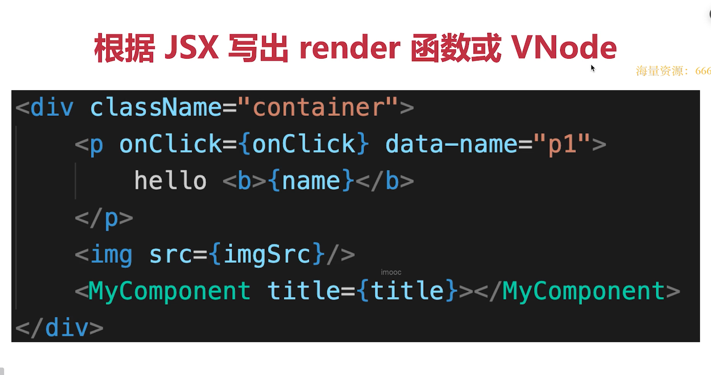

## vue3 与 vue2 的区别

1. 性能比 vue2 快了 1.2-2 倍
2. 使用 proxy 替代 Object.defineproperty，结局 vue2 中新增删除属性监听不到的问题，同时 proxy 支持对数组的监听，不需要像 vue2 对数组的方法拦截重写
3. diff 算法优化：增加静态标记(patchflag),虚拟节点对比时，只会对这些标记了的节点对比
4. 静态提升，vue3 对于不参与跟新的元素，会做静态提升，只会创建一次，渲染时直接复用即可，不需要像 vue2 中每次更新都会重新创建并渲染
5. 事件侦听器缓存：默认情况下 onClick 会被视为动态绑定，所以每次都会追踪它的变化，但是因为是同一个函数，所以不用追踪变化，直接缓存起来复用即可
6. 更好的 treeSharking
7. 组合式 api，hooks 更好的逻辑复用
8. 更好的 ts 支持

## Vue 组件通讯有哪几种方式

- props 和 $emit：父组件 props 传递数据给子组件，子组件通过 $emit 触发一个自定义事件，并且可以传递参数
- $parent / $children: 可以通过 $parent 和 $children 来访问组件的父级和子级组件实例。
- $refs: 可以使用 $refs 获取子组件实例或者 dom 元素。
- eventBus 兄弟组件数据传递 这种情况下可以使用事件总线的方式
- vuex 状态管理
- provide 和 inject：父组件通过 provide 提供数据，子组件通过 inject 注入数据。这种方式适用于层级较深的组件之间的通讯。

## vue2 和 vue3 使用 provide 和 inject

- vue 2 中

在父组件中，通过 provide 提供数据：

```vue
export default { provide: { message: 'Hello a, shuge!' } }
```

子组件中，可以通过 inject 来注入父组件提供的数据:

```vue
export default { inject: ['message'], mounted() { console.log(this.message); //
输出 'Hello, World!' } }
```

**provide 和 inject 绑定的数据是非响应式的，即如果提供的数据发生变化，不会触发子组件的重新渲染。**

> 需要注意的是如果提供的数据是一个对象或数组，那么在子组件中修改该对象或数组的值会影响到父组件中的值。

- Vue3 中的 provide 和 inject

用法与 Vue 2.x 中基本相同，不过有以下几点变化：

1. provide 和 inject 中可以使用 ref 和 reactive，这意味着提供的数据可以是响应式的。、
2. inject 可以使用 default 来设置默认值。

父组件中使用 provide：

```vue
import { provide, ref } from 'vue'; export default { setup() { const message =
ref('Hello, World!'); provide('message', message); } }
```

子组件中使用 inject:

```vue
import { inject } from 'vue'; export default { setup() { const message =
inject('message', 'Default message'); console.log(message.value); // 输出
'Hello, World!' } }
```

上面的代码中，子组件使用 inject 注入了父组件提供的名为 message 的数据，并使用 default 设置了默认值为 'Default message'。在子组件中，可以通过 message.value 来访问 message 的值。

## 追问：Vue 2 中的 provide 和 inject 父组件更新，会触发子组件的重新渲染吗，为什么

不会，这是因为 Vue 2.x 中的响应式系统是基于 Object.defineProperty 实现的，而 provide 提供的数据是不会被 Vue 的响应式系统所追踪的，所以当提供的数据发生改变时，并不会触发子组件的重新渲染。

但是可以通过 Vue.observable() 方法将一个对象包装成响应式的对象，并将其作为 provide 提供的数据。例如：

<!-- todo -->

```vue
import Vue from 'vue'; export default { provide() { return { data:
Vue.observable({ message: 'Hello, World!' }) }; } }
```

## Vue3 为什么支持多个根节点，实现原理是什么

Vue2 中只能有一个根节点，而 Vue3 中支持多个根节点，本质上 Vue3 每个组件还是一个根节点，因为 DOM 树只能是树状结构的，只是 Vue3 在编译阶段新增了判断，如果当前组件不只一个根元素，就添加一个 fragment 组件把这个多根组件的给包起来，相当于这个组件还是只有一个根节点。而 fragment 跟 keep-alive 一样是一个不会被渲染出来的内置组件

例如，在 Vue 3 中，下面的模板：

```vue
<template>
  <div>第一个节点</div>
  <div>第二个节点</div>
</template>
```

会被编译成下面的代码:

```vue
import { createVNode, Fragment } from 'vue' return () => [ createVNode(Fragment,
null, [ createVNode('div', null, '第一个节点'), createVNode('div', null,
'第二个节点') ]) ]
```

Vue 3 使用了 createVNode 函数创建了一个 Fragment 节点，并将多个子节点作为参数传入。在渲染时，这个 Fragment 节点会被忽略，只渲染其中的子节点。

通过使用 Fragment，Vue 3 实现了支持多个根节点的功能，同时也避免了在页面中多余的节点，提高了性能。

## v-for 和 v-if 为什么不推荐一起使用

在 V2 当中，v-for 的优先级更高，而在 V3 当中，则是 v-if 的优先级更高

方案一： 先在 computed 里过滤 数组。
方案二： 在 v-for 里面 在套一层 `<template v-if="item.id === 1">
// do something
</template>`

## vue3 中，ref 是基于 reactive 来实现的，为什么 ref 要返回一个包装对象？

在 Vue 3 中，ref 是基于 reactive 来实现的。ref 可以将一个基本数据类型（如字符串、数字、布尔值等）转换为一个响应式对象，使它可以在模板中双向绑定，或在 JavaScript 代码中进行响应式处理。

在 ref 中，返回一个包装对象是为了解决基本数据类型不可响应的问题。因为基本数据类型是不可变的，无法直接进行响应式处理。因此，ref 会将基本数据类型包装成一个对象，并为这个对象添加一个 value 属性，这个 value 属性才是响应式的。

因为对象引用类型，可以用来做代理或劫持，如果只返回基础类型的话，存储在栈中，执行栈里执行完就会被回收，没有办法添加代理或劫持，也就没办法追踪到后续的变化。

例如，使用 ref 创建一个字符串类型的响应式对象：

```vue
import { ref } from 'vue' const str = ref('hello') console.log(str.value) //
'hello'
```

在上面的代码中，ref 返回了一个包装对象，这个对象有一个 value 属性，它才是响应式的。因此，在使用这个字符串时，需要使用 str.value 来访问它的值。

当 str 的值发生变化时，value 属性也会发生变化，从而触发响应式更新。

总之，ref 返回一个包装对象，是为了解决基本数据类型不可响应的问题，使它们也可以进行响应式处理。

总结：

- ref 是一个对象（不丢失响应式），value 存储值
- 通过 .value 属性的 get 和 set 实现响应式

## 父子组件的生命周期

- **加载渲染阶段：** 父 beforeCreate => 父 created => 父 beforeMount => 子 beforeCreate => 子 created => 子 beforeMount => 子 mounted => 父 mounted
- **更新阶段：** 父 beforeUpdate -> 子 beforeUpdate -> 子 updated -> 父 updated
- **销毁阶段：** 父 beforeDestroy -> 子 beforeDestroy -> 子 destroyed -> 父 destroyed

## this.$nextTick 原理（vue2/3）

vue nextTick 的源码实现，异步优先级判断，总结就是 ```Promise -> MutationObserver -> setImmediate -> setTimeout

[this.$nextTick 你真的理解了吗？](https://juejin.cn/post/7177681326861418556)

## mounted 或者 updated 可以获取到最新的 dom 结构吗？

并不能保证所有子组件都渲染完成，所以你应该在其中使用 $nextTick

```js
mounted() {
  this.$nextTick(() => {
    // 所有子组件都已经渲染完成
  })
}
```

### nextTick 为什么要优先使用微任务实现？

因为根据 event-loop 和浏览器更新渲染时机，宏任务 -> 微任务 -> 渲染更新，而使用微任务，本次 event loop 就可以货渠道更新的 dom

如果使用微任务，那么得下次 event loop 才能获取到更新的 dom

vue2 的初始化过程做了哪些事情？

```js
new Vue走到了vue的构造函数中：`src\core\instance\index.js`文件。
​
this._init(options)
​
然后从Mixin增加的原型方法看，initMixin(Vue)，调用的是为Vue增加的原型方法_init
​
// src/core/instance/init.js
​
function initMixin (Vue) {
  Vue.prototype._init = function (options) {
     var vm = this; 创建vm,
     ...
     // 合并options 到 vm.$options
     vm.$options = mergeOptions(  
       resolveConstructorOptions(vm.constructor),
       options || {},  
       vm
     );
  }
  ...
   initLifecycle(vm); //初始生命周期
   initEvents(vm); //初始化事件
   initRender(vm); //初始render函数
   callHook(vm, 'beforeCreate'); //执行 beforeCreate生命周期钩子
   ...
   initState(vm);  //初始化data，props，methods computed，watch
   ...
   callHook(vm, 'created');  //执行 created 生命周期钩子
  
   if (vm.$options.el) {
      vm.$mount(vm.$options.el); //这里也是重点，下面需要用到
   }
 }
​
总结
​
所以，从上面的函数看来，new vue所做的事情，就像一个流程图一样展开了，分别是
​
-   合并配置
-   初始化生命周期
-   初始化事件
-   初始化渲染
-   调用 `beforeCreate` 钩子函数
-   init injections and reactivity（这个阶段属性都已注入绑定，而且被 `$watch` 变成reactivity，但是 `$el` 还是没有生成，也就是DOM没有生成）
-   初始化state状态（初始化了data、props、computed、watcher）
-   调用created钩子函数。
​
在初始化的最后，检测到如果有 el 属性，则调用 vm.$mount 方法挂载 vm，挂载的目标就是把模板渲染成最终的 DOM。
```

## 说一下你对 vue 响应式的理解，vue2/3 有何区别？

所谓的响应式就是我们能够根据数据的变化做出对应的响应机制

在 vue 中，当我们定义在响应式数据发生变化时，视图就会立即更新

vue2 中，对象数据类型通过 Object.defineProperty() 的方式定义数据拦截，当数据被访问或发生变化时，我们感知并作出响应；然后如果是数组的话则是重写了数组对象原型上的 7 个方法，这种机制很好的解决了响应式数据的问题，但是实际使用中还是存在一些问问题，比如初始化的递归遍历造成的性能损失，得使用 Vue.set/delete 新增删除属性才能做到对应的响应式处理，对于 es6 中新产生的 Map、Set 这些数据结构不支持，对于这些数据结构的监听需要开发者自行实现（Vue.observable()）

而 vue3 中使用 proxy 来实现响应式，很好的解决了这些问题，Vue3 的响应式具有惰性，具体来说，Vue3 的响应式系统使用 Proxy 对象来代理原始数据对象，当访问代理对象的属性时，才会进行数据劫持和依赖收集。当数据变化时，Vue3 会根据依赖关系进行有针对性的更新，这在多层级对象数据时尤其明显，因为只在访问对象的属性时才会进行数据劫持和依赖收集，而不是像 Vue2 那样进行全量更新，从而提高了性能。

> 当然你可以将 reactive 函数和 ref 函数的第二个参数设置为{ recursive: true }，这时 Vue3 会递归地将对象的所有属性都转换为响应式的，从而实现对对象的递归监听。

## 使用 Vue3 设计一个心跳组件，每个一秒打印 hello

```vue
<template>
  <div>心跳组件{{ num }}</div>
</template>

<script setup>
import { ref, onMounted, onBeforeUnmount } from 'vue'
const timer = ref(null)
const num = ref(0)
const fn = () => {
  console.log(`hello${num.value++}`)
  // “心跳”尽量避免用 setInterval 会有坑
  // 递归调用
  timer.value = setTimeout(fn, 1000)
}
onMounted(() => {
  setTimeout(fn, 1000)
})

// 组件销毁时候清理定时器
onBeforeUnmount(() => {
  timer.value && clearTimeout(timer.value)
})
</script>
```

## 简单说下 Vue 的 diff 算法


diff 算法是一种通过同层的树节点进行比较的高效算法

diff 算法的整体策略是：深度优先，同层比较
比较的过程中，循环从两边向中间靠拢

- 当数据发生改变，订阅者 watcher 会调用 patch 给真实 dom 打补丁
- 通过 isSameVNode 判断，相同则调用 patchVNode 方法
- 其中，patchVNode 将做以下几个操作
  1.  找到真实 dom ，称为 el
  2.  如果都由文本节点且不相等，那么将 el 文本节点设置为 VNode 的文本节点
  3.  如果 oldNode 有子节点而 newNoe 没有，则删除 el 子节点
  4.  如果 oldNode 没有子节点而 VNode 有，则将 VNode 的子节点真实化后添加到 el
  5.  如果两者都有子节点，则执行 updateChildren 函数比较子节点
- 其中 updateChildren 做了以下操作

1. 设置新旧 VNode 的头尾指针
2. 新旧指针头尾进行比较，向中间靠拢，再根据情况调用 patchVNode 进行 patch 重复流程，调用 createElem 创建一个新节点，从哈希表寻找 key 值一致的 VNode 再分情况进行后续操作

**vue2 双端对比，逐渐向中间靠拢**
**vue3 最长递增子序列**

## Vue 的三个核心模块

- Reactivity Module - 响应式模块
- Complier Module - 编译器模块
- Renderer Module - 渲染模块

## vue 的编译流程

模板 => 词法分析 => 语法分析 => 模板 AST => Transform => Javascript AST => 代码生成 => 渲染函数

Vue 编译流程的三大步：

1. parse：通过 parse 函数，把模板编译为 AST 对象(**源代码的抽象语法的树状结构表示**)
2. Transform： 通过 Transform 函数，把 ASt 转换为 Javascript AST
3. generate：通过 generate 函数，把 Javascript AST 转换为 render（渲染函数）

## vue 组件渲染过程

Vue 组件的渲染过程可以分为以下几个阶段：

1. 解析模板：Vue 会解析组件的模板，将其转换为一个渲染函数。
2. 触发响应式，监听 data 属性 getter、setter

3. 执行渲染函数：渲染函数会返回一个 VNode 对象，描述了组件的 DOM 结构。

4. 生成真实 DOM：Vue 会根据 VNode 对象来创建真实的 DOM 节点。

5. 挂载到页面：将真实 DOM 节点挂载到页面上，完成渲染过程。

在 Vue 的响应式系统中，当组件的数据发生变化时，会触发 setter（此前已被 getter 监听）会触发重新渲染。这时，Vue 会再次执行渲染函数，并生成新的 VNode 对象。然后，Vue 会使用 Diff 算法比较新旧 VNode 对象的差异，并只更新需要更新的部分，从而实现高效的 DOM 操作。

## 项目按钮权限

[面试官问我按钮级别权限怎么控制](https://juejin.cn/post/7209648356530896953)

## vite

### vite 原理

1. 通过 koa 开启一个服务，回去请求的静态文件内容
2. 通过`es-module-lexer`解析`ast`拿到 import 的内容
3. 判断 import 倒入模块是否为第三方模块，是的话做路径的替换，换成了 /@modules/ 返回给浏览器，浏览器发起对 /@modules/ 的请求，并且由 vite 再次拦截，返回 node_module 下的模块， 如 import vue 返回 import './@modules/vue'
4. 如果是.vue 文件，vite 拦截对应的请求，读取.vue 文件内容进行编译，把一个 .vue 的文件拆成了三个请求（分别对应 script、style 和 template） ，浏览器会先收到包含 script 逻辑的 App.vue 的响应，然后解析到 template 和 style 的路径后，会再次发起 HTTP 请求来请求对应的资源，此时 Vite 对其拦截并再次处理后返回相应的内容。
5. 通过 babel parse 对 js 进行编译，最终返回编译后的 js 文件

> Vite 主要对应的场景是开发模式（生产模式是用 rollup 打包）

Vite 的是通过 WebSocket 来实现的热更新通信，监听来自服务端的 HMR 消息推送。

[](https://juejin.cn/post/6844904146915573773)

## vuex 原理

1. vuex 本质就是一个没有 template 的隐藏式的 vue 组件
2. vuex 利用 vue 的 mixin 混入机制，于 beforeCreate 生命钩子混入 vuexInit 方法
3. vuexInit 方法将 vuex store 注册到当前组件的 $store 属性上
4. vuex 的 state 作为一个隐藏的 vue 组件的 data，定义在 state 上面的变量，相当于这个 vue 实例的 data 属性，凡是定义在 data 上的数据都是响应式的
5. 当页面上使用了 vuex state 中的数据时，就是依赖收集的过程，当 vuex 中的数据变化时，通过调用对应属性的 dep 对象的 notify 方法，去修改试图变化

## vue-router 原理

1. 创建的页面路由会与该页面形成一个路由表（key value 形式，key 为该路由，value 为对应的页面）
2. 监听 URL 变化，然后匹配路由规则，新路由页面替换旧页面，达到无需刷新的目的
3. 单页面路由目前主要两种方式：`hash 模式，history模式`
4. hash 模式：通过 hashchange 事件监听路由变化 `window.addEventListener('hashchange', （)=>{})`
5. history 模式: 通过 pushState() 和 replaceState() 方法，实现网历史记录添加新的或替换对应的浏览记录，通过 popSate 事件监听 路由变化，`window.addEventListener('popstate', ())=>{})`

## vue history 模式 nginx 配置

```bash
server {
    listen 80;
    server_name example.com;

    location / {
        root /var/www/example.com/dist;
        try_files $uri $uri/ /index.html;
    }
}
```

在这个示例中，我们告诉 Nginx 监听 80 端口，并将所有流量发送到名为 example.com 的服务器。location /指定了 Web 根目录，并使用 try_files 指令来确保 Nginx 能够正确地处理 Vue 路由。

具体来说，try_files 指令尝试按顺序查找文件或目录，直到找到一个存在的位置。如果找不到任何匹配项，则返回/index.html，这是 Vue 应用程序的入口点。

如果 Vue 应用程序不在 Web 根目录下，请相应地更改根路径。如果使用的是 HTTPS，则应将 listen 指令更改为 443，并提供证书和密钥文件。

## vue2 是怎么做到监听数组的

在 Vue2 中，监听数组的实现是通过重写数组变异方法（mutation methods）来实现的。

具体地说，Vue2 中使用了一个名为 Observer 的类来观察数据对象，如果数据对象是一个数组，则会对其进行特殊处理。在处理数组时，Vue2 会获取数组原型上的变异方法（例如 push、pop、shift、unshift、splice 等），然后对这些方法进行改写，以便在执行这些方法时能够发出变化通知。

具体来说，Vue2 会将这些变异方法重写成如下形式：

```js
const arrayProto = Array.prototype
const arrayMethods = Object.create(arrayProto)

;['push', 'pop', 'shift', 'unshift', 'splice', 'sort', 'reverse'].forEach(
  function (method) {
    const original = arrayProto[method]
    def(arrayMethods, method, function mutator(...args) {
      const result = original.apply(this, args)
      const ob = this.__ob__
      let inserted
      switch (method) {
        case 'push':
        case 'unshift':
          inserted = args
          break
        case 'splice':
          inserted = args.slice(2)
          break
      }
      if (inserted) ob.observeArray(inserted)
      // notify change
      ob.dep.notify()
      return result
    })
  }
)
```

> Object.defineProperty 实际是可以做到监听数组的，通过 arr[index]=val 监听数组下标来做到，但是为了性能取舍而没有这样做

```js
var arr = [1, 2, 3, 4]
arr.forEach((item, index) => {
  Object.defineProperty(arr, index, {
    set: function (val) {
      console.log('set')
      item = val
    },
    get: function (val) {
      console.log('get')
      return item
    },
  })
})
arr[1] // get  2
arr[1] = 1 // set  1
```

## vue3 更快了，它做了哪些优化

- proxy 响应式
- tree-shaking
- 静态提升

  - 将静态节点的定义，提升到父级别，缓存起来
  - 多个相邻的静态节点会被合并

## Proxy 手写 vue3 reactive 及 effect

```js
// reactive.js
function reactive(target) {
  // 不是对象或数组直接返回
  if (typeof target !== 'object' || target === null) {
    return target
  }

  const handler = {
    get(target, key, receiver) {
      // 收集依赖
      track(target, key)

      const result = Reflect.get(target, key, receiver)
      return reactive(result) // 递归处理子属性
    },
    set(target, key, value, receiver) {
      const oldValue = Reflect.get(target, key, receiver)
      let result = true

      if (oldValue !== value) {
        result = Reflect.set(target, key, value, receiver)
        // 触发更新
        trigger(target, key)
      }

      return result // 是否设置成功 true/false
    },
    deleteProperty(target, key) {
      const hasKey = Object.prototype.hasOwnProperty.call(target, key)
      if (hasKey) {
        Reflect.deleteProperty(target, key)
        // 触发更新
        trigger(target, key)
      }
      return true
    },
  }

  return new Proxy(target, handler)
}

// effect.js
function effect(fn) {
  // 创建响应式函数
  const effectFn = reactive(fn)

  // 执行响应式函数
  effectFn()

  // 返回响应式函数
  return effectFn
}

// track.js
const targetMap = new WeakMap() // 存储依赖关系的 Map

function track(target, key) {
  let depsMap = targetMap.get(target)

  if (!depsMap) {
    depsMap = new Map()
    targetMap.set(target, depsMap)
  }

  let dep = depsMap.get(key)

  if (!dep) {
    dep = new Set()
    depsMap.set(key, dep)
  }

  dep.add(effectFn) // 存储依赖
}

// trigger.js
function trigger(target, key) {
  const depsMap = targetMap.get(target)
  if (!depsMap) {
    return
  }

  const dep = depsMap.get(key)
  if (!dep) {
    return
  }

  dep.forEach((effectFn) => effectFn()) // 触发更新
}
```

receiver 是用于绑定 this 关键字的。在 get()、set()、has()、deleteProperty() 等方法中，this 关键字通常指向 Proxy 对象本身。但是，如果我们将 Proxy 对象作为其他对象的属性，那么 this 关键字就可能指向其他对象。此时，我们可以使用** receiver 参数来绑定 this 关键字，确保它指向正确的对象**。

## 为什么 Proxy 一定要配合 Reflect 使用？

[为什么 Proxy 一定要配合 Reflect 使用？](https://juejin.cn/post/7080916820353351688#heading-5)

## hooks useForm useDialog

## 根据 JSX 写出 render 函数或 VNode



- 写出对应 render 函数

```js
function render() {
  return h(
    'div',
    {
      props: {
        className: 'container',
      },
    },
    [
      // <p>
      h(
        'p',
        {
          dataset: {
            name: 'p1',
          },
          on: {
            click: onClick,
          },
        },
        ['hello ', h('b', {}, [name])]
      ),
      // img
      h(
        'img',
        {
          props: {
            src: imgSrc,
          },
        },
        []
      ),
      // 自定义组件
      h(
        myComponent,
        {
          props: {
            title: title,
          },
        },
        []
      ),
    ]
  )
}
```

- 写出对应 VNode

```js
const vNode = {
  tag: 'div',
  props: {
    className: 'container'
  },
  children: [
    {
      tag: 'p',
      props: {
        dataset: {
          name: 'p1'
        },
        on: {
          click: onClick
        }
      },
      children: [
        'hello ',
        { tag: "b", children: [name] }
      ]
    },
    // img
    {
      tag: 'img',
      props: {
        src: imgSrc
      }
    },
    // myComponent
    {
      tag: myComponent,
      props: {
        title: title
      }
    }
  ]
}

## 参考
[历时一个月，2.6W字！50+Vue经典面试题源码级详解，你值得收藏！](https://juejin.cn/post/7097067108663558151)
```
