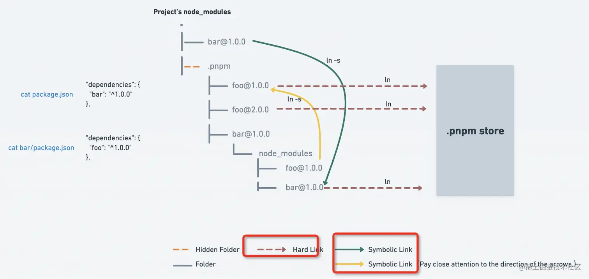

- 基于现有开源组件库 element-ui ,二次封装 Vue 前端组件库 sanh-ui，适配了公司这边的设计风格，另外除了基础组件外还针对业务设计了一些业务组件，极大的提高了开发效率。

- 参与攻克技术难点（防删除水印组件，大文件切片下载，组件库的按需引入，自定义报表，微前端统一端口部署）

**防删除水印组件；**

[vue项目页面设置水印，使用MutationObservers防止从控制台改变样式](https://blog.csdn.net/yinge0508/article/details/128185822?spm=1001.2101.3001.6650.7&utm_medium=distribute.pc_relevant.none-task-blog-2%7Edefault%7EBlogCommendFromBaidu%7ERate-7-128185822-blog-123659558.235%5Ev32%5Epc_relevant_default_base3&depth_1-utm_source=distribute.pc_relevant.none-task-blog-2%7Edefault%7EBlogCommendFromBaidu%7ERate-7-128185822-blog-123659558.235%5Ev32%5Epc_relevant_default_base3&utm_relevant_index=8)

[Vue<页面水印，防删除，防修改>](https://www.jianshu.com/p/0d6c357d37eb)

(waterMark)[https://github.com/wwenj/public-component/tree/master/%E9%98%B2%E5%88%A0%E9%99%A4%E7%9A%84%E9%A1%B5%E9%9D%A2%E6%B0%B4%E5%8D%B0%E7%BB%84%E4%BB%B6]

[vue后台水印实现
](https://blog.csdn.net/weixin_52703987/article/details/124010045)

[聊一聊如何在 Vue 项目中实现水印功能](https://blog.csdn.net/Ed7zgeE9X/article/details/127743008)


在收到 offer 之前，尽量聊一些工作之内的事情。
比如：

- 当前岗位的明确工作内容
- 公司对该岗位的要求
- 是否会有新人培训
- 团队人数与在公司的工作年限：如果团队有很多人在公司的工作年限比较长，那么可以侧面证明公司还不赖。


之前

- 工程质量监管
- 市政、交通、铁路、水利等各类工程建设领域


## npm、yarn、pnpm的区别

npm2.x 的依赖是嵌套的，相同的依赖会重复安装，占据磁盘空间，yarn 采用依赖平铺的方式，相同依赖会被提升（相同包的不同版本，依然还是用嵌套的方式。）

>npm 后来升级到 3 之后，也是采用这种铺平的方案了

出现的问题：

**幽灵依赖的问题：没有声明在 package.json dependencies 里的依赖，代码里却可以import**

pnpm 安装速度比 npm yarn 快2倍，节省磁盘空间

>会将依赖包安装在全局的store中，依赖的每个版本只会在系统中安装一次

pnpm采用网状 + 平铺的结构

**.pnpm目录（虚拟存储目录）采用平铺，node_modules 目录树的结构，类似npm version 2.x版本**

在引用项目依赖时,会通过软连接和硬连接在全局的store中找到这个包，所有的依赖都是从全局 store 硬连接到了 node_modules/.pnpm 下，然后之间通过软链接来相互依赖。



- 硬链接 Hard link：硬链接可以理解为源文件的副本，硬链接是一种在文件系统中建立多个文件名指向同一块磁盘区域的技术，可将一个文件映射到多个不同的路径上，使用的是同一个 inode 节点，本质上是文件系统中的一条记录。硬链接会遵循文件系统的约束，在多个路径删除、移动或重命名时，会始终保持对原始文件内容的访问权限。（```硬链接只能用于文件不能用于目录```）
- 符号链接 Symbolic link（软链接）：可以理解为快捷方式，软链接的本质是一个文本文件，记录了目标文件路径和名称，且软链接会在某些情况下被自动删除或失效。


npm2 是通过嵌套的方式管理 node_modules 的，会有同样的依赖复制多次的问题。
npm3+ 和 yarn 是通过铺平的扁平化的方式来管理 node_modules，解决了嵌套方式的部分问题，但是引入了幽灵依赖的问题，并且同名的包只会提升一个版本的，其余的版本依然会复制多次。
pnpm 则是用了另一种方式，不再是复制了，而是都从全局 store 硬连接到 node_modules/.pnpm，然后之间通过软链接来组织依赖关系。
这样不但节省磁盘空间，也没有幽灵依赖问题，安装速度还快，从机制上来说完胜 npm 和 yarn。
我们选择 pnpm还有一个重要原因是因为pnpm 内置了对单一存储库（也称为多包存储库）的支持，你只需要创建一个 workspace 就可将多个项目合并到一个仓库中，这样的作用是能在我们开发调试多包时，彼此间的依赖引用更加简单。

## 大文件切片上传
 
前端需要做的：
- 文件格式校验
- 文件切片、md5计算
- 发起检查请求，当前文件hash发送给服务器，检查是否有相同hash的文件（断点续传和秒传）
- 上传进度展示
- 通知后台进行切片合并

通过 file.slice 方法对大文件进行切割，利用 spark-md5.js 计算文件唯一的 hash 值，点击开始上传，发送文件的 hash 值给服务端，服务端返回是否需要上传以及已经上传过的区块号码（hash+分割时的下标），根据服务端返回，若需要上传则过滤掉已经上传的区块继续上传余下的区块，若不需要上传则表示已经上传过，实现秒传的效果。

>切片的核心思想是：创建一个空的切片列表数组chunkList，将大文件按照每个切片2MB进行切片操作，因为 File 接口没有定义任何方法，但是它从 Blob 接口继承了以下方法：
Blob.slice([start[, end[, contentType]]])

前端可以基于 Promise.all 将这多个接口整合，上传完成在发送一个合并的请求，通知服务端进行合并。


[参考](https://juejin.cn/post/7074534222748188685)、[面试官针对大文件上传的追问](https://juejin.cn/post/7182105299921141817)

## 实现大文件并行下载

主要实现思路：

1. 将大文件进行切片，
2. axios **请求头中设置Range参数**，指定请求范围（Range: `bytes=${rangeStart}-${rangeEnd}`），并设置超时时间
3. promise.all 并发下载所有数据块，放到一个数组中
4. 将所有数据块进行合并，使用Blob、File进行合并

**请求范围不合法将返回 416 状态码**

```html
<!DOCTYPE html>
<html lang="en">
  <head>
    <script src="https://www.unpkg.com/axios@1.3.5/dist/axios.min.js"></script>
  </head>
  <body>
    
    <script>
      async function concurrencyDownload(path, size, chunkSize) {
        let chunkNum = Math.ceil(size / chunkSize)

        const downloadTask = []
        for (let i = 1; i <= chunkNum; i++) {
          const rangeStart = chunkSize * (i - 1)
          const rangeEnd = chunkSize * i - 1

          downloadTask.push(
            axios.get(path, {
              headers: {
                Range: `bytes=${rangeStart}-${rangeEnd}`,
              },
              responseType: 'arraybuffer',
            })
          )
        }
        const arrayBuffers = await Promise.all(
          downloadTask.map((task) => {
            return task.then((res) => res.data)
          })
        )
        return mergeArrayBuffer(arrayBuffers)
      }

      function mergeArrayBuffer(arrays) {
        let totalLen = 0
        for (let arr of arrays) {
          totalLen += arr.byteLength
        }
        let res = new Uint8Array(totalLen)
        let offset = 0
        for (let arr of arrays) {
          let uint8Arr = new Uint8Array(arr)
          res.set(uint8Arr, offset)
          offset += arr.byteLength
        }
        return res.buffer
      }

      ;(async function () {
        const { data: len } = await axios.get('http://localhost:3000/length')
        const res = await concurrencyDownload(
          'http://localhost:3000',
          len,
          300000
        )
        console.log(res)

        const blob = new Blob([res])
        const url = URL.createObjectURL(blob)
        img.src = url
      })()
    </script>
  </body>
</html>
```
大文件下载 要控制并发数量,可以使用 asyncPool 这个库

>可以使用 Blob 和 File 对象来合并所有数据块

```js
// 下载的数据块存放在 result 数组中
const blobArray = result.map(data => new Blob([data]));
const mergedBlob = new Blob(blobArray, { type: 'application/octet-stream' });
```

[JavaScript 中如何实现大文件并行下载？](https://juejin.cn/post/6954868879034155022)、[基于 HTTP Range 实现文件分片并发下载！](https://juejin.cn/post/7219140831365857317)、[手摸手，带你完成大文件分片下载](https://juejin.cn/post/7025885508748181512)


## 微前端统一端口部署

假设主项目是部署在根目录下，子项目部署在二/三级目录。

在子项目打包之前需要做两件事：

1. vue 项目想部署在二级目录，必须配置 webpack 打包的 publicPath

```js
publicPath: '/vue-history/',
```

2. history 模式路由需要设置 base：

```js
base: window.__POWERED_BY_QIANKUN__ ? '/app-vue-history' : '/vue-history',
```

部署之后注意四点：

1. activeRule 、子项目菜单的路由前缀、history 模式路由的 base ，这三个的值是一样的。
2. activeRule 不能和子项目的真实访问路径一样，否则在主项目页面刷新会直接变成子项目页面
3. 子项目的真实访问路径就是子项目的 entry，entry 可以为相对路径
4. 子项目的 entry 路径最后面的 / 不可省略，否则 publicPath 会设置错误，例如子项的访问路径是 http://localhost:8080/app1,那么 entry 就是 http://localhost:8080/app1/

[参考](https://github.com/umijs/qiankun/issues/400)