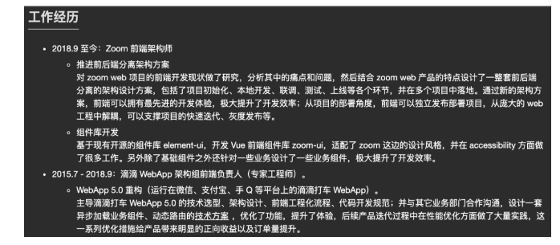

- 基于现有开源组件库 element-ui ,二次封装 Vue 前端组件库 sanh-ui，适配了公司这边的设计风格，另外除了基础组件外还针对业务设计了一些业务组件，极大的提高了开发效率。

- 参与攻克技术难点（防删除水印组件，大文件切片下载，组件库的按需引入，自定义报表，微前端统一端口部署）

**防删除水印组件；**

[vue项目页面设置水印，使用MutationObservers防止从控制台改变样式](https://blog.csdn.net/yinge0508/article/details/128185822?spm=1001.2101.3001.6650.7&utm_medium=distribute.pc_relevant.none-task-blog-2%7Edefault%7EBlogCommendFromBaidu%7ERate-7-128185822-blog-123659558.235%5Ev32%5Epc_relevant_default_base3&depth_1-utm_source=distribute.pc_relevant.none-task-blog-2%7Edefault%7EBlogCommendFromBaidu%7ERate-7-128185822-blog-123659558.235%5Ev32%5Epc_relevant_default_base3&utm_relevant_index=8)

[Vue<页面水印，防删除，防修改>](https://www.jianshu.com/p/0d6c357d37eb)

(waterMark)[https://github.com/wwenj/public-component/tree/master/%E9%98%B2%E5%88%A0%E9%99%A4%E7%9A%84%E9%A1%B5%E9%9D%A2%E6%B0%B4%E5%8D%B0%E7%BB%84%E4%BB%B6]

[vue后台水印实现
](https://blog.csdn.net/weixin_52703987/article/details/124010045)

[聊一聊如何在 Vue 项目中实现水印功能](https://blog.csdn.net/Ed7zgeE9X/article/details/127743008)


在收到 offer 之前，尽量聊一些工作之内的事情。
比如：

- 当前岗位的明确工作内容
- 公司对该岗位的要求
- 是否会有新人培训
- 团队人数与在公司的工作年限：如果团队有很多人在公司的工作年限比较长，那么可以侧面证明公司还不赖。


之前

- 工程质量监管
- 市政、交通、铁路、水利等各类工程建设领域


## npm、yarn、pnpm的区别

npm2.x 的依赖是嵌套的，相同的依赖会重复安装，占据磁盘空间，yarn 采用依赖平铺的方式，相同依赖会被提升（相同包的不同版本，依然还是用嵌套的方式。）

>npm 后来升级到 3 之后，也是采用这种铺平的方案了

出现的问题：

**幽灵依赖的问题：没有声明在 package.json dependencies 里的依赖，代码里却可以import**

pnpm 安装速度比 npm yarn 快2倍，节省磁盘空间

>会将依赖包安装在全局的store中，依赖的每个版本只会在系统中安装一次

pnpm采用网状 + 平铺的结构

**.pnpm目录（虚拟存储目录）采用平铺，node_modules 目录树的结构，类似npm version 2.x版本**

在引用项目依赖时,会通过软连接和硬连接在全局的store中找到这个包，所有的依赖都是从全局 store 硬连接到了 node_modules/.pnpm 下，然后之间通过软链接来相互依赖。


- 硬链接 Hard link：硬链接可以理解为源文件的副本，硬链接是一种在文件系统中建立多个文件名指向同一块磁盘区域的技术，可将一个文件映射到多个不同的路径上，使用的是同一个 inode 节点，本质上是文件系统中的一条记录。硬链接会遵循文件系统的约束，在多个路径删除、移动或重命名时，会始终保持对原始文件内容的访问权限。（```硬链接只能用于文件不能用于目录```）
- 符号链接 Symbolic link（软链接）：可以理解为快捷方式，软链接的本质是一个文本文件，记录了目标文件路径和名称，且软链接会在某些情况下被自动删除或失效。


npm2 是通过嵌套的方式管理 node_modules 的，会有同样的依赖复制多次的问题。
npm3+ 和 yarn 是通过铺平的扁平化的方式来管理 node_modules，解决了嵌套方式的部分问题，但是引入了幽灵依赖的问题，并且同名的包只会提升一个版本的，其余的版本依然会复制多次。
pnpm 则是用了另一种方式，不再是复制了，而是都从全局 store 硬连接到 node_modules/.pnpm，然后之间通过软链接来组织依赖关系。
这样不但节省磁盘空间，也没有幽灵依赖问题，安装速度还快，从机制上来说完胜 npm 和 yarn。
我们选择 pnpm还有一个重要原因是因为pnpm 内置了对单一存储库（也称为多包存储库）的支持，你只需要创建一个 workspace 就可将多个项目合并到一个仓库中，这样的作用是能在我们开发调试多包时，彼此间的依赖引用更加简单。