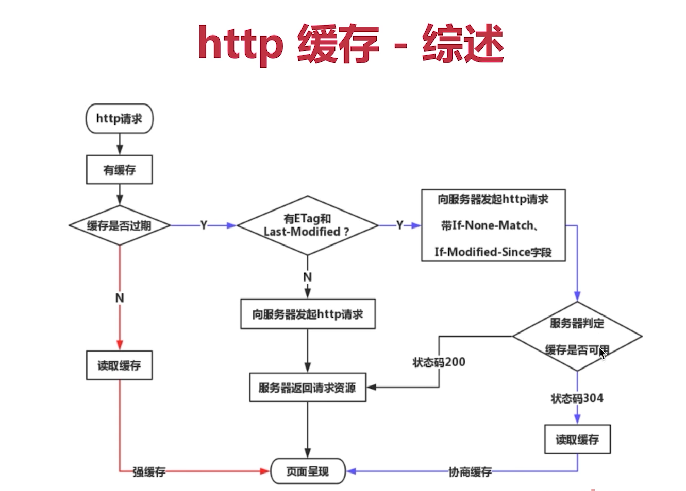

## 跨域

跨域：非同源策略请求
同源策略：浏览器的安全机制
源=协议+端口+域名 同源-三个都相等


## cache-control 几个值及区别

Cache-Control是HTTP协议中用于控制缓存行为的头部字段，常见的取值和其含义如下：

1. no-cache：表示每次请求都要向服务器发送请求，不使用本地缓存。

2. no-store：表示请求或响应中不能缓存任何内容，每次请求都必须重新获取。

3. max-age=<seconds>：表示资源在客户端本地缓存的最大时间（以秒为单位）。

4. public：表示响应可以被任何缓存（包括代理服务器）缓存。

5. private：表示响应只能被单个用户缓存，中间的代理服务器不能缓存。

6. must-revalidate：表示在使用已过期的缓存前必须先向服务器验证缓存的有效性。

7. proxy-revalidate：类似于must-revalidate，但仅对代理服务器生效。

这些值的组合也可能出现，例如“no-cache, max-age=3600”，表示本地缓存的最大时间为1小时，但每次必须向服务器进行验证以确保缓存的有效性。

**Cache-Control  no-cache no-store 区别**

`Cache-Control: no-cache`指示客户端缓存被禁止，但代理服务器仍然可以进行缓存。而`Cache-Control: no-store`指示所有缓存都被禁止，包括客户端和代理服务器，不允许任何缓存。

简而言之，`no-cache`只是不允许缓存，但如果代理服务器已经有了缓存，客户端仍然可以使用；而`no-store`则直接禁止了所有缓存，客户端和代理服务器都不能再缓存该资源。

## 从输入URL到页面加载发生了什么？

1. 浏览器查找当前 URL 是否存在缓存，并比较缓存是否过期
  **有缓存**

  如为强缓存，通过 ```Expires 和 Cache-control：max-age``` 来判断缓存是否过期，两者同时存在的的话，Cache-control：max-age 优先级更高

  >Cache-Control: no-cache 和no-store的区别：实际上Cache-Control: no-cache是会被缓存的，只不过浏览器每次都会向服务器发起请求，来验证当前缓存的有效性，Cache-Control: no-store：这个才是响应不被缓存的意思

  如为协商缓存，通过 if-none-match(Etag) 和 if-modified-since(last-modified) 验证缓存是否有效，若有效则返回状态码为 304，否则返回资源，返回状态码为 200

  
2. DNS 解析 URL 对应 ip
3. TCP 三次握手
4. HTTP 发起请求
5. 服务端处理请求，浏览器接受 HTTP 响应
6. 渲染页面，构建 dom 树
  ① 解析html 生成 DOM 树
  ②根据 css 解析生成 css树
  ③结合 DOM 树和 CSS 规则树，生成渲染树
  ④根据渲染树计算每一个节点的信息（layout布局）
  ⑤根据计算好的信息绘制页面


如果遇到 script 标签，则判断是否含有 defer 或者 async 属性，如果有，异步去下载该资源；如果没有设置，暂停dom的解析，去加载script的资源，然后执行该js代码（script标签加载和执行会阻塞页面的渲染）
7. TCP 四次挥手，关闭连接

## TCP的三次握手和四次挥手

### 三次握手

1）第一次握手：客户端向服务端发送连接请求报文，请求发送后，客户端便进入 SYN-SENT 状态
2）第二次握手：服务端收到连接请求报文段后，如果同意连接，则会发送一个应答，发送完成后便进入 SYN-RECEIVED 状态
3）第三次握手：当客户端收到连接同意的应答后，还要向服务端发送一个确认报文。客户端发完这个报文段后便进入 ESTABLISHED(已建立的) 状态，服务端收到这个应答后也进入 ESTABLISHED 状态，此时连接建立成功

**为什么需要三次握手**

确保服务端和客户端均让对方知道自己接受发送能力没问题而保证的最小次数，两次不安全，四次浪费资源

### 四次挥手 

当服务端收到客户端关闭报文时，并不会立即关闭，先回复一个报文，告诉客户端，"你发的FIN报文我收到了"。只有等到我Server端所有的报文都发送完了，我才能发送连接释放请求，因此不能一起发送。故需要四步挥手
举例：
Browser:先告诉服务器 “我数据都发完了，你可以关闭连接了。”
Server:回复浏览器 “关闭的请求我收到了，我先看看我这边还有没有数据没传完。”
Server:确认过以后，再次回复浏览器 “我这边数据传输完成了，你可以关闭连接了。”
Browser:告诉服务器 “好的，那我关闭了。不用回复了。”
客户端又等了2MSL，确认确实没有再收到请求了，才会真的关闭TCP连接。

**为什么需要四次挥手？**
1）TCP 使用四次挥手的原因，是因为 TCP 的连接是全双工的，所以需要双方分别释放掉对方的连接
2）单独一方的连接释放，只代 表不能再向对方发送数据，连接处于的是半释放的状态
3）最后一次挥手中，客户端会等待一段时间再关闭的原因，是为了防止客户端发送给服务器的确认报文段丢失或者出错，从而导致服务器端不能正常关闭
什么是2MSL？
MSL是Maximum Segment Lifetime英文的缩写，中文可以译为“报文最大生存时间”

**四次挥手后，为什么客户端最后还要等待2MSL？**
1）保证客户端发送的最后一个ACK报文能够到达服务器，因为这个ACK报文可能丢失，如果服务端没有收到，服务端会重发一次，而客户端就能在这个2MSL时间段内收到这个重传的报文，接着给出回应报文，并且会重启2MSL计时器
2）防止“已经失效的连接请求报文段”出现在本连接中
客户端发送完最后一个确认报文后，在这个2MSL时间中，就可以使本连接持续的所产生的所有报文都从网络中消失。这样新的连接中不会出现旧连接的请求报文


## TCP和UDP的区别

相同点：  UDP协议和TCP协议都是传输层协议
不同点：

1）TCP 面向有连接； UDP：面向无连接
2）TCP 要提供可靠的、面向连接的传输服务。TCP在建立通信前，必须建立一个TCP连接，之后才能传输数据。TCP建立一个连接需要3次握手，断开连接需要4次挥手，并且提供超时重发，丢弃重复数据，检验数据，流量控制等功能，保证数据能从一端传到另一端
3）UDP不可靠性，只是把应用程序传给IP层的数据报发送出去，但是不能保证它们能到达目的地
4）应用场景
TCP效率要求相对低，但对准确性要求相对高的场景。如常见的接口调用、文件传输、远程登录等
UDP效率要求相对高，对准确性要求相对低的场景。如在线视频、网络语音电话等

## http1、2、3的区别

http1:

- 最基础的HTTP协议
- 支持基本的 get post 请求

http1.1

- 缓存策略，cache-control E-tag等
- 长链接 keep-alive，一次tcp链接多次请求
- 支持新的 put delete，可用于restful api

## http常见的状态码

- 200：请求成功
- 204：请求被成功处理，但未返回任何内容
- 301：所请求的资源被**永久**转移到了新的位置
- 302：请求的地址已经**临时**移动到了新的位置。这个状态码通常意味着重定向
- 304：请求资源未被修改，可直接使用浏览器的缓存（协商缓存-浏览器向服务端发送请求，携带if-none-match(Etag) 和 if-modified-since(last-modified) 头部的请求验证缓存是否有效，若有效则返回状态码为 304，否则返回资源，返回状态码为 200）
- 401：需要用户认证身份信息才能访问
- 403：没有权限访问资源
- 500：服务器内部错误
- 503：服务器无法处理请求,可能实在维护中

## 线程与进程

**一个进程可以包含多个线程**

进程是 CPU 资源分配的最小单位，线程是 CPU 调度的最小单位

- 进程中的任一线程执行出错，会导致整个进程的崩溃
- 线程之间共享进程中的数据
- 进程之间的内容相互隔离
- 当一个进程关闭后，操作系统会回收进程作占用的内存

**开一个网页，至少需要四个进程：1个网络进程、1个浏览器进程、1个GPU进程、1个渲染进程，如果页面运行有插件，还要加一个插件进程**

## js 为什么设计成单线程

浏览器中js执行和dom渲染共用一个线程

如果有多个线程，假如一个线程在 DOM 节点上添加内容，另一个线程删除了这个节点，那么就会造成冲突，我了避免冲突，所以决定了 js 为单线程的

## 浏览器为什么限制并发请求数量
- 对操作系统端口资源考虑

PC总端口数为65536，那么一个TCP（http也是tcp）链接就占用一个端口。操作系统通常会对总端口一半开放对外请求，以防端口数量不被迅速消耗殆尽。

- 过多并发导致频繁切换产生性能问题

一个线程对应处理一个http请求，那么如果并发数量巨大的话会导致线程频繁切换。而线程的上下文切换有时候并不是轻量级的资源。这导致得不偿失，所以请求控制器里面会产生一个链接池，以复用之前的链接。所以我们可以看作同域名下链接池最大为4～8个，如果链接池全部被使用会阻塞后面请求任务，等待有空闲链接时执行后续任务。

- 避免同一客服端并发大量请求超过服务端的并发阈值

在服务端通常都对同一个客户端来源设置并发阀值避免恶意攻击，如果浏览器不对同一域名做并发限制可能会导致超过服务端的并发阀值被BAN掉。

- 客户端良知机制

为了防止两个应用抢占资源时候导致强势一方无限制的获取资源导致弱势一方永远阻塞状态。

### 浏览器线程包含

- 浏览器主线程

主要负责界面显示、用户交互、子进程管理，同时提供存储等功能。

1）GUI渲染线程
主要负责页面的渲染，解析 HTML、CSS，构建 DOM 树，布局和绘制等
2）JS引擎线程
该线程主要负责处理 JavaScript 脚本，执行代码。该线程与 GUI 渲染线程互斥，当 JS 引擎线程执行 JavaScript 脚本时间过长，将导致页面渲染的阻塞。
3）事件触发线程
主要负责将准备好的事件交给 JS 引擎线程执行。比如 setTimeout 定时器计数结束， ajax 等异步请求成功并触发回调函数，或者用户触发点击事件时，该线程会将整装待发的事件依次加入到任务队列的队尾，等待 JS 引擎线程的执行
4）定时器触发线程
负责执行异步定时器一类的函数的线程，如： setTimeout，setInterval
5）异步http请求线程
负责执行异步请求一类的函数的线程，如： Promise，axios，ajax 等


- render 渲染进程

核心任务是将 HTML、CSS 和 JavaScript 转换为用户可以与之交互的网页，排版引擎 Blink 和 JavaScript 引擎 V8 都是运行在该进程中，默认情况下，Chrome 会为每个 Tab 标签创建一个渲染进程。出于安全考虑，渲染进程都是运行在沙箱模式下

- GPU 进程

GPU 的使用初衷是为了实现 3D CSS 的效果，只是随后网页、Chrome 的 UI 界面都选择采用 GPU 来绘制

- 第三方插件进程

主要是负责插件的运行，因插件易崩溃，所以需要通过插件进程来隔离，每种类型的插件对应一个进程， 以保证插件进程崩溃不会对浏览器和页面造成影响。

## 浏览器渲染原理

浏览器的渲染过程大致可以分为以下几个步骤：

1. HTML 解析：浏览器首先会将接收到的 HTML 代码解析成一棵 DOM 树，它表示文档结构和内容。

2. CSS 解析：浏览器接下来会对页面中所有的 CSS 样式进行解析，浏览器会把 CSS 样式表解析成 CSSOM 树。
   
3. 创建渲染树：渲染树指的是将 DOM 树和 CSSOM 树合并后的结果，它只包含需要显示的节点和这些节点的样式信息。在创建渲染树时，浏览器会忽略掉一些不需要显示的节点，例如 <head> 中的内容和隐藏的元素。

4. 布局：在生成渲染树之后，浏览器会对渲染树上的所有节点进行布局处理，计算出每个节点在屏幕上的位置和大小等信息，并形成由多个合成图层（Compositing Layers）组成的绘制列表。

5. 绘制：在完成布局之后，浏览器开始遍历绘制列表，根据其中的绘制指令将图形元素绘制到屏幕上。

6. 合成：如果页面中存在多个图层，则浏览器在绘制过程中还要针对不同图层进行混合和合并，形成最终显示在屏幕上的画面。

需要注意的是，浏览器渲染是一个逐步优化的过程，渲染流程中的许多阶段都会受到各种因素（如 JavaScript 执行、网络状态等）的影响，因此在实际开发中，也需要注意对渲染过程的优化。

另外，在浏览器渲染过程中还涉及到以下几个概念：重排（Reflow）、重绘（Repaint）和合成（Compositing）。其中，重排是指当布局信息改变时，浏览器需要重新计算元素的位置和大小等信息；而重绘则是指当元素的样式改变时，浏览器需要重新绘制它们的外观；最后，合成则是指对多个图层进行混合和合并，形成最终的画面。为了提高页面性能，需要尽可能避免或减少重排和重绘的发生。

## 垃圾回收机制


## 前端攻击手段

### xss

- 跨站脚本攻击
- 手段：将js代码插入到网页内容中，渲染时执行js代码
- 预防：特殊字符替换（前后端）

### csrf

- 跨站请求伪造
- 手段：黑客诱导用户去访问另外一个网站的接口，伪造请求
- 预防：严格的跨域限制-验证码机制
   - 严格的跨域请求限制，如判断referrer
   - cookie设置samesite，禁止跨域传输cookie
   - 关键接口使用短信验证码
  
- 点击劫持
- DDos

## options 预检请求

发出非简单跨域请求，浏览器会做一个http的查询请求（预检请求）也就是options，检查服务器是否支持跨域请求，并且确认实际请求的安全性。预检请求的目的是为了保护客户端的安全，防止不受信任的网站利用用户的浏览器向其他网站发送恶意请求。

什么时候会触发预检请求：
- 发送跨域请求时，请求头包含了一些非简单请求的头信息，例如自定义头（custom header）等
- 发送跨域请求时，使用了 PUT、DELETE、CONNECT、OPTIONS、TRACE、PATCH等请求方法。

## 参考

[10万字前端知识体系总结（前端框架+浏览器原理篇）](https://juejin.cn/post/7146996646394462239)


