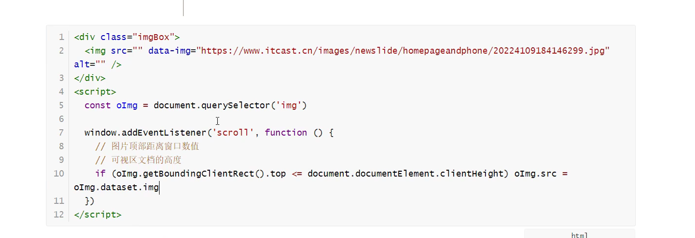
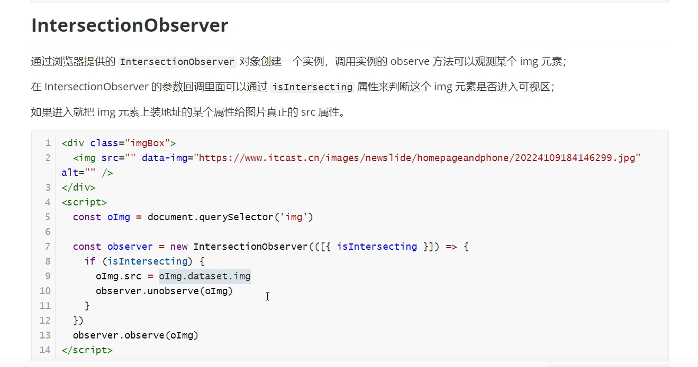

## 如何判断一个元素是否在可视区域中

1. offsetTop、scrollTop
2. getBoundingClientRect
3. IntersectionObserver

- getBoundingClientRect



- IntersectionObserver



[参考](http://fanyouf.gitee.io/interview/nb/03.html#%E4%BA%8C%E3%80%81%E5%AE%9E%E7%8E%B0%E6%96%B9%E5%BC%8F)

## 实现一个函数，入参是一个 fn，延迟 5s 执行，并且拿到返回值

```js
function sleep(fn) {
  return new Promise((resolve) => {
    setTimeout(() => {
      resolve(fn())
    }, 5000)
  })
}

function f() {
  return '彼时彼刻，恰如此时此刻'
}

console.log(Date.now())
const old = Date.now()
sleep(f).then((res) => {
  console.log(res, Date.now() - old)
})
```

## vue

- [Vue2 和 Vue3 的响应式原理比对](https://juejin.cn/post/7124351370521477128)

## 前端模块化

[当你被问到前端模块化](https://juejin.cn/post/7193887403570888765)

## 大文件断点续传

通过 file.slice 方法对大文件进行切割，利用 spark-md5.js 计算文件唯一的 hash 值，点击开始上传，发送文件的 hash 值给服务端，服务端返回是否需要上传以及已经上传过的区块号码（hash+分割时的下标），根据服务端返回，若需要上传则过滤掉已经上传的区块继续上传余下的区块，若不需要上传则表示已经上传过，实现秒传的效果。


## SaaS销售

SaaS销售是指企业使用软件即服务（Software-as-a-Service）模式进行产品的销售，在这个过程当中，能够达到客户和供应商的双赢局面。

TOB和TOC：

1、面向对象不同：TOB企业主要面向的是企业即客户，而不是个人用户；TOC面向的是个人即用户。 
2、关注点不同：TOB是服务思维，关注的核心是效率提升；TOC是流量思维，关注的核心是用户体验。