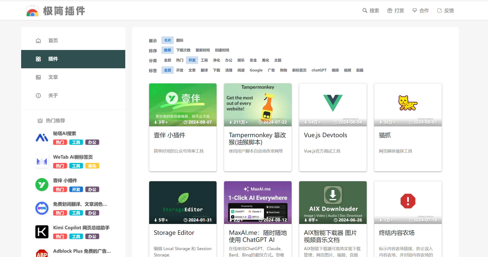
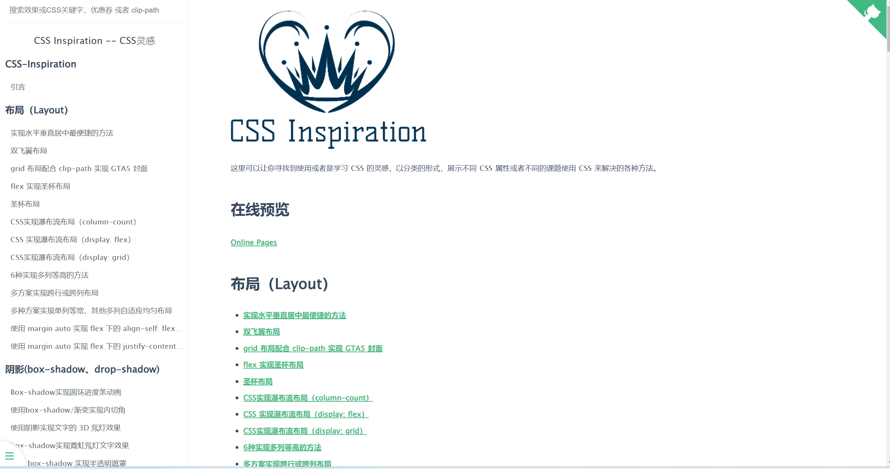
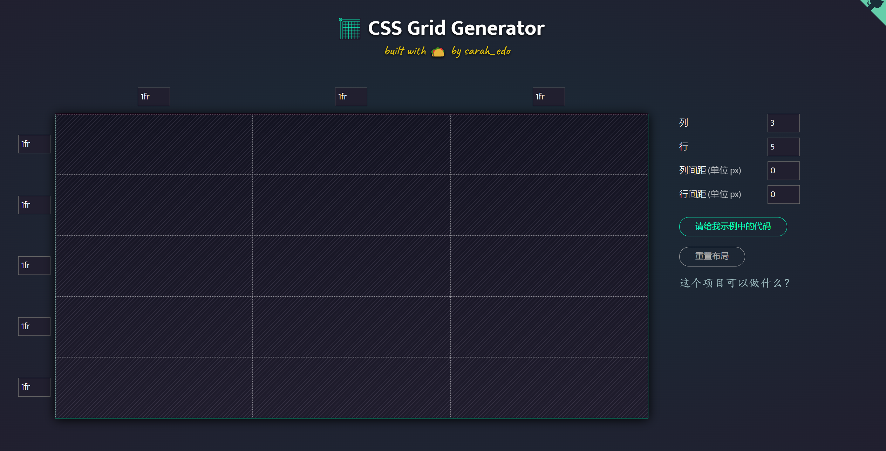
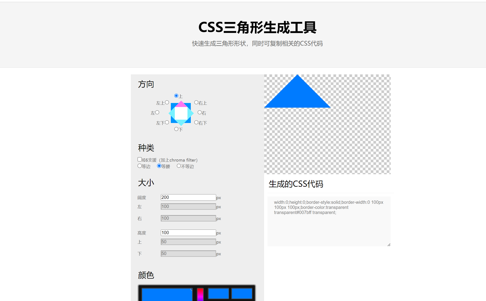
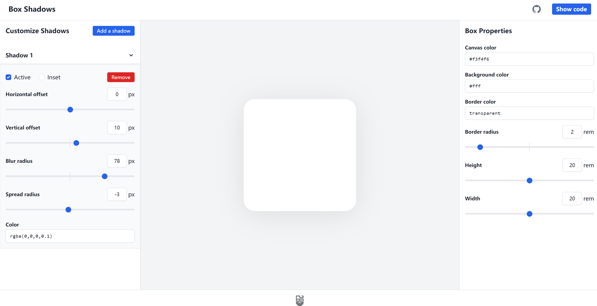
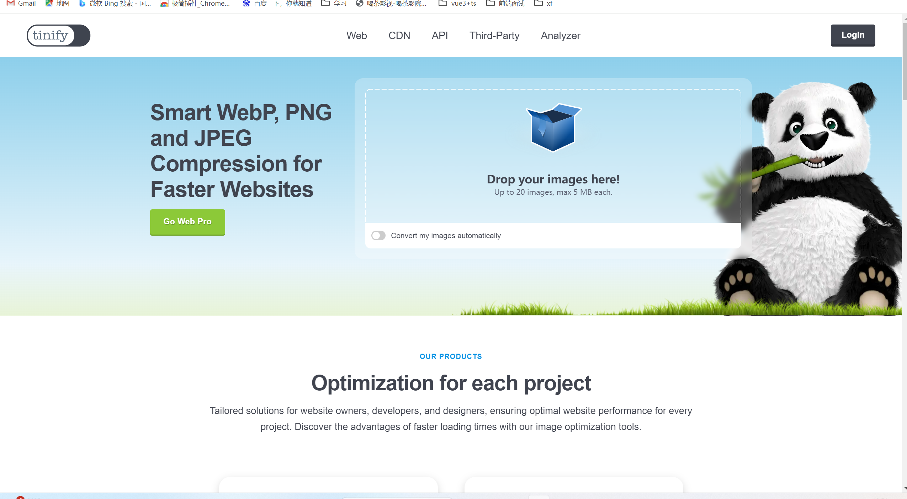
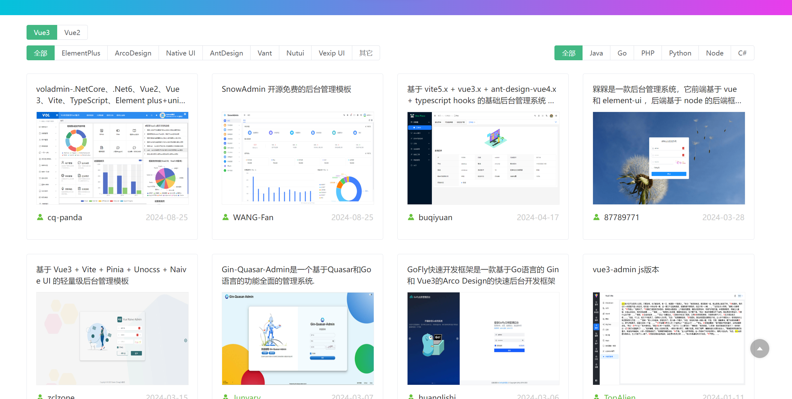
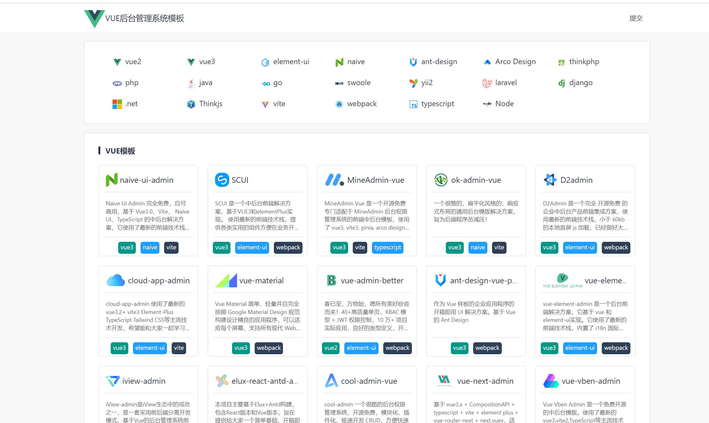
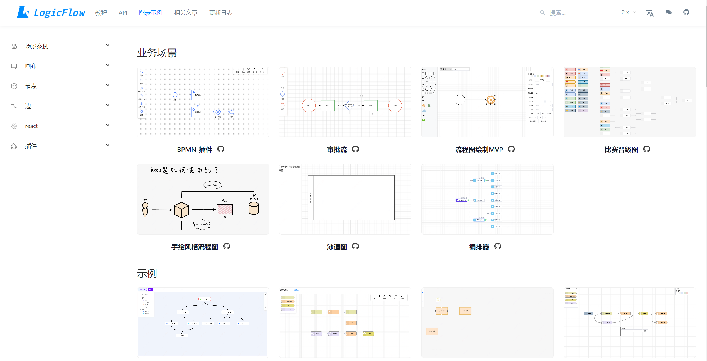

## 极简插件

[极简插件](https://chrome.zzzmh.cn/index#/index)

## CSS 灵感

[CSS 灵感](https://csscoco.com/inspiration/#/)

## CSS3 动画

[CSS3动画代码大集合](https://www.webhek.com/post/css3-animation-sniplet-collection/#/)

## grid 在线布局

[grid 在线布局](https://cssgrid-generator.netlify.app/)

## css 渐变

[uigradients](https://uigradients.com/#Maldives)

## CSS三角形生成工具

[CSS三角形生成工具](https://www.jiangweishan.com/tool/sanjx/index.html)

## 阴影生成工具

[阴影生成工具](https://box-shadow.dev/)

## json2ts

[json2ts](http://json2ts.com/)

## 熊猫压缩

[tinypng](https://tinypng.com/)

## CSS Loaders 加载动画

[CSS Loaders 加载动画](https://css-loaders.com/dots/)

## 动效交互组件

[uiverse](https://uiverse.io/)

## 在线 PDF 转换工具：Easy PDF

[Easy PDF](https://easy-pdf.com/)

## 抽象语法树解析
[AST Explorer](https://astexplorer.net/)

## 封面模板-canva
[canva](https://www.canva.cn/)

## 管理后台模板集合

[海量实用的管理模板集合](https://vue-admin.cn/admin)

[VUE后台管理系统模板](http://vue.easydo.work/)

## echarts 样例

[madeapie](https://madeapie.com/#/examples)
[ppchart](https://ppchart.com/#/)
[isqqw](https://www.isqqw.com/?t=pie)
[chartlib](http://chartlib.datains.cn/echarts)

## 工作流

[flowable](https://site.logic-flow.cn/examples#/gallery)

