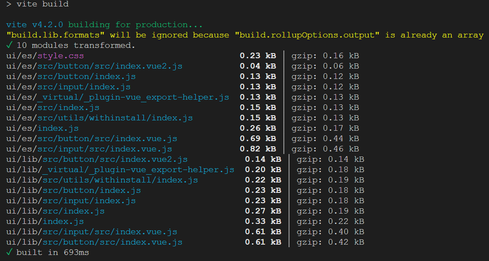
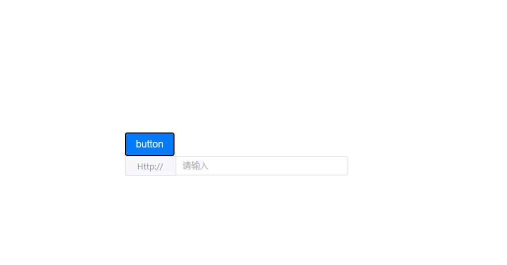
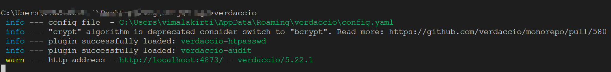
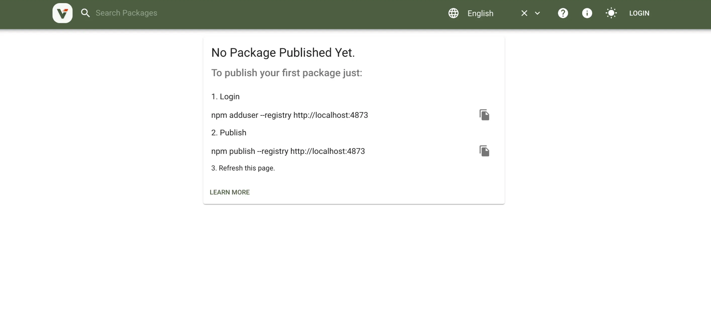

## pnpm 是什么

 pnpm 是 performant npm（高性能的 npm），它是一款快速的，节省磁盘空间的包管理工具，同时，它也较好地支持了 workspace 和 monorepo，简化开发者在多包组件开发下的复杂度和开发流程。

pnpm 为 performant npm 的简称，意为高性能的 npm

pnpm 主要有以下优点:

- 快速: pnpm 比其他包管理工具快两倍;
- 高效: node_modules 中的文件链接自特定的内容寻址存储库;
- 支持 monorepo: pnpm 内置了对存储库中的多个包的支持;
- 严格: pnpm 默认创建一个非平铺的 node_modules,因此代码不能访问任意包;

## 快速入门

安装 pnpm 

```shell
npm install -g pnpm
```


新建文件夹作为工作区 ，例如我这里新建文件夹 ``` monorepo-demo```

cd 到目录下

### 初始化环境

- 初始化
```
pnpm init 
```

文件夹下生成了 ```package.json```

根目录下新建 packages
再新建 pnpm-workspace.yaml文件，用来声明对应的工作区，写入如下内容：

```yaml
packages:
  # 存放组件库和其他工具库
  - 'packages/*'
  # 存放组件测试的代码
  - 'example'
```

这里我们打算把我们的组件库 components 放于 packages 下，这样如果后续有需要我们还可以在packages文件夹下添加工具库 utils，example 则为示例项目。

接下来我们创建组件库项目和示例项目

在根目录下执行：```pnpm create vite example```
用 vite 创建一个vue3项目作为示例项目，为跟我们实际项目接近，我们暂时选择了安装这些


接着在根目录下，执行：```pnpm create vite components```
选择 Vue+JavaScript 两项

```shell
? Select a framework: » - Use arrow-keys. Return to submit.
? Select a framework: » - Use arrow-keys. Return to submit.
√ Select a framework: » Vue
√ Select a variant: » JavaScript
```

这里我们用 vite 创建了一个vue3项目，后续我们的组件库将在此基础上开发

### 编写一个组件

我们进入 components 目录下，并运行以下 ```pnpm i`` 安装项目依赖,然后启动项目

src文件夹下新建 button 文件夹和 index.js 文件（用于集中导出src下的所有组件），并写入以下文件，

```js
components
···
├─ src
  ├─ button
     ├─ src
       └─ index.vue // 我们的组件代码
  └─ index.js // 用于导出button组件
└─ index.js // 集中导出src下的所有组件
···
```

基本结构如上，src 中编写组件内容，index.js 中插件形式导出组件

index.vue 编写我们的 button 组件代码如下
```vue
<template>
  <button class="button" :class="typeClass">
    <slot></slot>
  </button>
</template>

// 两个 script 的形式，这个用于定义 name 属性
<script>
export default {
  name: 'SButton',
}
</script>
<script setup>
import { computed } from 'vue'
const props = defineProps({
  type: {
    type: String,
    default: 'default'
  }
})
const typeClass = computed(() => `button-${props.type}`)
</script>

<style lang="scss" scoped>
.button {
  border-radius: 4px;
  padding: 8px 16px;
  font-size: 16px;
  cursor: pointer;

  &-default {
    background-color: #eee;
    color: #333;
  }

  &-primary {
    background-color: #007bff;
    color: #fff;
  }
}
</style>
```

上面我们为了定义组件的 name ，采用了两个 script 标签的形式，这样虽然可以，但是写两个 script 标签不够优雅，有时候也让开发人员费解，我们希望可以```<script name="SButton" setup>``` 这样的形式，我们借助插件来实现

- 安装 vite-plugin-vue-setup-extend -D

components 目录下
```shell
pnpm add vite-plugin-vue-setup-extend -D
```

- vite.config.js 配置
```js
import { defineConfig } from 'vite'
import vue from '@vitejs/plugin-vue'
import VueSetupExtend from 'vite-plugin-vue-setup-extend'

export default defineConfig({
  plugins: [vue(),VueSetupExtend()]
})
```

- 使用

我们把 button 组件定义 name 的部分更改如下：
```vue
...

<!-- 注释定义name 的 script -->
<!-- <script>
export default {
  name: 'SButton',
}
</script> -->

<!-- 利用安装的插件，直接于script 标签上定义 name 属性 -->
<script name='SButton' setup>
import { computed } from 'vue'
const props = defineProps({
  type: {
    type: String,
    default: 'default'
  }
})
const typeClass = computed(() => `button-${props.type}`)
</script>
...
```

上面的组件样式部分用到了 scss ，所以我们需要进行安装，我们可以在 components 目录下执行 ```pnpm add sass -D```
当然，除了进入子包目录 pnpm add pkgname 直接安装之外，还可以通过过滤参数 ```--filter```或 ```-F``` 指定命令作用范围

例如，我们为 example 示例项目也安装 sass

```shell
# --filter 或者 -F <package_name> 可以在指定目录 package 执行任务
pnpm -F example add sass   # 在根目录中向 example 目录安装 sass
```

更多的过滤配置可参考：[filtering](https://www.pnpm.cn/filtering)


### 二次封装 el-input 组件

上面我们写了一个简单的 button 组件，但是实际开发中，我们更多的其实是基于现有组件库做二次封装，这里我们选择基于 element-ui 做二次封装。

如此前这篇文章[当我们对组件二次封装时我们在封装什么](https://juejin.cn/post/7127925414885851144#heading-4)提到的封装思路，我们想基于 el-input 实现这样一个需求：希望 el-input 默认可清空，即 clearable 默认为 ture

首先，我们给 components 项目安装 element-ui，这里安装不再赘述，大家可以直接按[官网](https://element-plus.gitee.io/zh-CN/guide/installation.html#%E7%8E%AF%E5%A2%83%E6%94%AF%E6%8C%81)来

安装完毕后，我们在src下新建input文件夹，里面文件结构和 button 一致，基于 el-input 的 input 组件封装如下：
```vue
// index.vue
<template>
  <el-input v-bind="$attrs" :placeholder="placeholder" :clearable="clearable">
     <template #[slotName] v-for="(slot, slotName) in $slots" >
      <slot :name="slotName" />
    </template>
  </el-input>
</template>

<script name="SInput" setup>
defineProps({
  clearable: {
    type: Boolean,
    default: true
  },
  placeholder: {
    type: String,
    default: '请输入'
  }
})
</script>

<style lang="scss" scoped></style>
```

### 导出组件

组件写完之后，我们需要将其导出，因为我们的组件想要在打包后支持```全量引入```和```按需引入```
考虑到后面我们的组件库肯定还有很多组件，所以我们写一个导出方法
components/src 下新建 utils/withInstall.js

withInstall.js 写入以下：

```js
export default comp => {
  comp.install = app => {
    // 当组件是 script setup 的形式时，会自动以为文件名注册，会挂载到组件的__name 属性上
    // 所以要加上这个条件
    const name = comp.name || comp.__name
    //注册组件
    app.component(name, comp)
  }
  return comp
}
```


使用刚刚封装的函数导出我们的组件：
```src/button/index.js``` 文件导出刚刚的 button 组件,

```js
// src/button/index.js
import { withInstall } from '../utils/withInstall';
import button from './src/index.vue';

// 导出 install
const Button = withInstall(button);
// 导出button组件
export default Button;
```

>input 组件也类似步骤导出

然后再在 src 下的 index.js 的文件下管理我们所有的组件

```js
// components/src/index.js
import SButton from './button'
import SInput from './input'


export { SButton, SInput }

export default [SButton, SInput]
```

最后 components 组件库目录下新建 index.js 集中导出所有

```js
// components/index.js
import components from './src/index';

export * from './src/index';

export default {
  install: app => components.forEach(c => app.use(c)),
};
```

组件库配置打包，更改components项目的 vite.config.js如下：

```js
import { defineConfig } from 'vite'
import vue from '@vitejs/plugin-vue'
import { resolve } from 'path'
import VueSetupExtend from 'vite-plugin-vue-setup-extend'

// https://vitejs.dev/config/
export default defineConfig({
  plugins: [vue(),VueSetupExtend()],
  base: './',
  build: {
    target: 'modules',
    //打包文件目录
    outDir: 'es',
    //压缩
    minify: true,
    //css分离
    //cssCodeSplit: true,
    rollupOptions: {
      //忽略打包vue、element-plus
      external: ['vue', 'element-plus'],
      input: ['index.js'],
      output: [
        {
          format: 'es',
          //不用打包成.es.js,这里我们想把它打包成.js
          entryFileNames: '[name].js',
          //让打包目录和我们目录对应
          preserveModules: true,
          exports: 'named',
          //配置打包根目录
          dir: resolve(__dirname, './ui/es'),
        },
        {
          format: 'cjs',
          entryFileNames: '[name].js',
          //让打包目录和我们目录对应
          preserveModules: true,
          exports: 'named',
          //配置打包根目录
          dir: resolve(__dirname, './ui/lib'),
        },
      ],
    },
    lib: {
      entry: './index.js',
      name: 'shuge',
      formats: ['es', 'cjs'],
    },
  },
})
```

## 引用组件库

好，我们的组件已经写好了，那么我们想要看到效果呢，当然，我们可以启动 components项目，然后 app.vue 里引入编写的组件查看，那么我们该如何在示例项目 example 中使用刚刚开发的组件呢


- 首先修改 package.json
将组件库 ```components package.json``` name 修改为 @vmkt/shuge-ui(以便我们后续包的引入),version修改为 0.0.1，private 修改为 false 代表我们这个组件库需要对外发布，然后添加打包后的入口
```json
// 使用 require('xxx') 方式引入时, 引入的是这个文件
"main": "./ui/lib/index.js",
// 使用 import x from 'xxx' 方式引入组件时，引入的是这个文件
"module": "./ui/es/index.js",
```
最终修改后的 package.json 如下：

```json
{
  "name": "@vmkt/shuge-ui",
  // 代表我们这个组件库需要对外发布
  "private": false,
  "version": "0.0.1",
  // 使用 require('xxx') 方式引入时
  "main": "./ui/lib/index.js",
  // 使用 import x from 'xxx' 方式引入组件时
  "module": "./ui/es/index.js",
  "type": "module",
  // 配置打包上传文件到npm的文件夹内容
  "files": [
    "ui"
  ],
  "scripts": {
    "dev": "vite",
    "build": "vite build",
    "preview": "vite preview"
  },
  "dependencies": {
    "element-plus": "^2.3.0",
    "vue": "^3.2.47"
  },
  "devDependencies": {
    "@vitejs/plugin-vue": "^4.1.0",
    "sass": "^1.59.3",
    "vite": "^4.2.0",
    "vite-plugin-vue-setup-extend": "^0.4.0"
  }
}
```
- 打包组件库

上面配置都完成后，我们于 components 目录下执行 ```pnpm run build```将组件库进行打包



同时components根目录下可以看到多出了我们打包后的组件


- example 安装组件库

example 目录下执行```pnpm add @vmkt/shuge-ui``` 引用我们的组件库 

然后可以看到 example 下的 package.json 添加上了依赖


我们在 example 里引入我们的组件测试一下，

- 全局引入

```js
// example/src/main.js
...
// 我们的组件 input 依赖于 element-ui，example 项目同样先安装再引入
import ElementPlus from 'element-plus'
import 'element-plus/dist/index.css'

import shuge from '@vmkt/shuge-ui'
import  '@vmkt/shuge-ui/ui/es/style.css'

...
app.use(shuge)
...
```

app.vue 原有内容全部删除，然后写入：
```vue
<template>
  <div>
    <s-button @click="onClick" type="primary">button</s-button>
    <s-input v-model="value">
      <template #prepend>Http://</template>
    </s-input>
  </div>
</template>

<script setup>
import { ref } from 'vue'
import { SButton, SInput } from '@vmkt/shuge-ui'
const value = ref('')
const onClick = () => {
  console.log('click')
}
</script>
```

启动 example 项目，可以看到按钮已经正常显示，说明我们的全局引入是成功的


- 按需引入
**先注释掉刚刚 main.js 里的引入代码**
改在具体页面引入，这里我们在app.vue进行引入```import { SButton, SInput } from '@vmkt/shuge-ui'```，app.vue 修改后如下：

```vue
<template>
  <div>
    <s-button @click="onClick" type="primary">button</s-button>
    <s-input v-model="value">
      <template #prepend>Http://</template>
    </s-input>
  </div>
</template>

<script setup>
import { ref } from 'vue'
import { SButton, SInput } from '@vmkt/shuge-ui'
const value = ref('')
const onClick = () => {
  console.log('click')
}
</script>
```
 可以看到页面也是正常显示的


至此，我们利用 vue3+pnpm monorepo 开发组件库已经完成，下面我们将打包后的组件库发布的私有仓库

## verdaccio 搭建npm私有仓库

verdaccio 是一个轻量级的 npm 缓存终端，按需缓存所有依赖项,并加速本地或私有网络中的安装，是搭建 npm 私服较为流行的方案之一

- 全局安装 verdaccio

```shell
npm i -g verdaccio
```

- 然后，在终端中输入 verdaccio 命令启动 verdaccio：

```shell
verdaccio
```

启动成功，终端输出如下



里面是它的配置文件位置、启动的服务地址等信息

默认 verdaccio 启动的服务都会在 4873 这个端口，在浏览器中输入 http://localhost:4873/ 出现如上页面就说明服务启动成功了：



### 本地发布 npm 包到私有仓库

在此之前，你需要先[注册 npm 的账号](https://www.npmjs.com/)

**1、 登录**

```shell
npm adduser --registry  http://localhost:4873
```
输入npm账号用户名、密码和邮箱,登录成功后如下：

```shell
Username: yourUsername
Password: 
Email: (this IS public) 1xxxx@qq.com
Logged in as yourUsername on http://localhost:4873/.
```

**2、发布 npm 包到私有仓库**

进入到我们的组件库 components 目录下，执行

```
npm publish --registry http://localhost:4873/
```

发布成功以后如下：
```shell
npm notice 
npm notice package: @vmkt/shuge-ui@0.0.4
npm notice === Tarball Contents ===
npm notice 285B ui/es/style.css
npm notice 134B ui/es/_virtual/_plugin-vue_export-helper.js
npm notice 202B ui/lib/_virtual/_plugin-vue_export-helper.js
npm notice 257B ui/es/index.js
npm notice 126B ui/es/src/button/index.js
npm notice 145B ui/es/src/index.js
npm notice 126B ui/es/src/input/index.js
npm notice 153B ui/es/src/utils/withinstall/index.js
npm notice 327B ui/lib/index.js
npm notice 231B ui/lib/src/button/index.js
npm notice 269B ui/lib/src/index.js
npm notice 231B ui/lib/src/input/index.js
npm notice 223B ui/lib/src/utils/withinstall/index.js
npm notice 694B ui/es/src/button/src/index.vue.js
npm notice 989B ui/es/src/input/src/index.vue.js
npm notice 611B ui/lib/src/button/src/index.vue.js
npm notice 770B ui/lib/src/input/src/index.vue.js
npm notice 41B  ui/es/src/button/src/index.vue2.js
npm notice 41B  ui/es/src/input/src/index.vue2.js
npm notice 138B ui/lib/src/button/src/index.vue2.js
npm notice 138B ui/lib/src/input/src/index.vue2.js
npm notice 509B package.json
npm notice 535B README.md
npm notice === Tarball Details ===
npm notice name:          @vmkt/shuge-ui
npm notice version:       0.0.4
npm notice package size:  2.9 kB
npm notice unpacked size: 7.2 kB
npm notice shasum:        16a8e623842e7028a3bb8445af177efd9ec99c75
npm notice integrity:     sha512-79a9TMF41gv55[...]cQ5ISub13FUvQ==
npm notice total files:   23
npm notice
+ @vmkt/shuge-ui@0.0.4
```

在浏览器中刷新 http://localhost:4873 页面


可以看到，我们的组件库 shuge-ui 已经发布成功，接下来我们对其安装使用一下

### 使用私有仓库npm包

我们首先起一个项目，找一个空白文件，cmd 输入：
```
pnpm create vite demo
```

选择创建一个 vue 项目，安装依赖并启动


下载我们发布到私有仓库的npm包时，需要修改仓库地址，具体操作如下

```shell
npm set registry http://localhost:4873
```

在执行这条命令以后，再使用```pnpm add @vmkt/shuge-ui```命令就会优先去我们自己的私有仓库下载npm包，如何没有找到，则会从npm中央仓库下载

```shell
ackages: +22
++++++++++++++++++++++
Progress: resolved 80, reused 55, downloaded 3, added 22, done

dependencies:
+ @vmkt/shuge-ui 0.0.4

The integrity of 4629 files was checked. This might have caused installation to take longer.
Done in 33.7s
```

安装成功后会如上显示输出


因为我们的组件库还依赖于 element-plus
所以我们同样进行安装一下 
```shell
pnpm add element-ui
```

最后我们和 example 里操作一样，全局引入和按需引入测试一下我们的组件库,如全局引入：

```js
// main.js
import { createApp } from 'vue'
import './style.css'
import App from './App.vue'
import ElementPlus from 'element-plus'
import 'element-plus/dist/index.css'
import shuge from '@vmkt/shuge-ui'
import  '@vmkt/shuge-ui/ui/es/style.css'

const app = createApp(App)

app.use(ElementPlus)
app.use(shuge)

app.mount('#app')
```

```vue
// app.vue
<template>
  <div>
    <s-button @click="onClick" type="primary">button</s-button>
    <s-input v-model="value">
      <template #prepend>Http://</template>
    </s-input>
  </div>
</template>

<script setup>
import { ref } from 'vue'
const value = ref('')
const onClick = () => {
  console.log('click')
}
</script>
```

http://localhost:5173/ 刷新页面，可以看到，我们的组件库使用正常


至此，我们使用 vue3+ pnpm monorepo 搭建组件库发布到私有仓库，并在项目中使用的教程就到这里结束了

## 参考
[pnpm官网](https://pnpm.io/zh/)
[pnpm+vite+vue3搭建业务组件库踩坑之旅](https://www.jianshu.com/p/392edbd5ce3b)

## 往期回顾
[vue3 正式发布两年后，我才开始学 — vue3+setup+ts 🔥](https://juejin.cn/post/7158331832512020511)
<br>
[2022年了，我才开始学 typescript ，晚吗？（7.5k字总结）](https://juejin.cn/post/7124117404187099172)
<br>
[当我们对组件二次封装时我们在封装什么](https://juejin.cn/post/7127925414885851144)
<br>
[vue 项目开发，我遇到了这些问题](https://juejin.cn/post/7119018849353072677)
<br>
[关于首屏优化，我做了哪些](https://juejin.cn/post/7117515006714839047)

- 安装包到根目录

```shell
# 安装到工作区根目录并且是开发依赖
pnpm install 包名 -D -w
```

- 安装包到子目录 --filter
- 
利用--filter 可以直接在根目录指定安装依赖到子包，当然--filter还有其他功能。

```shell
# --filter 或者 -F <package_name> 可以在指定目录 package 执行任务
pnpm i -F demo       # 在根目录中向demo目录安装所有依赖
pnpm i vue -F demo   # 在根目录中向demo目录安装vue
```

## 软链接与硬链接

[软链接和硬链接](https://zhuanlan.zhihu.com/p/442133074)

pnpm 使用软链接和硬链接两种方式的原因是为了优化安装和升级依赖包的速度和空间占用。

软链接是一种特殊的文件，它像一个指针一样指向另一个文件或目录，而不是实际的拷贝。当使用软链接安装依赖包时，pnpm 只需在全局缓存中保存一份依赖包副本，然后在项目中创建软链接指向这个副本。这样，当多个项目使用同一个依赖包时，各个项目之间共享同一个副本，节省了磁盘空间。

硬链接是一种特殊的文件链接，它与软链接类似，但不同的是硬链接不是指针，而是与原始文件共享同一个 inode，即实际上是同一个文件。当使用硬链接安装依赖包时，pnpm 可以在全局缓存中创建多个硬链接，每个硬链接指向同一个依赖包副本。这种方式可以更快地复制和升级依赖包，因为每个硬链接都指向同一个 inode，所以只需更新一次就能同时更新所有硬链接。

综上所述，pnpm 使用软链接和硬链接两种方式可以提高依赖包的安装和升级速度，同时节省磁盘空间。

## pnpm为什么不只使用软链接
pnpm 之所以不只使用软链接，是因为软链接有一些缺点：

1. 软链接会占用更多的硬盘空间：软链接会在硬盘上创建一个新的文件，它的大小与被链接的文件相同，这样就会占用更多的硬盘空间。

2. 软链接会导致性能下降：软链接需要在运行时进行解析，这会导致一定的性能下降。

3. 软链接可能会出现循环链接：如果两个文件相互软链接，就会形成循环链接，这会导致一些问题。

因此，pnpm 使用了类似于硬链接的方式，将依赖包存储在一个共享的位置，然后使用符号链接将它们链接到每个项目中。这种方式可以减少硬盘空间的使用，提高性能，并避免循环链接的问题。

尽管软链接可以减少磁盘空间的占用，但是仅使用软链接会存在一些问题。首先，软链接只能在不同文件系统之间使用，这意味着如果开发者在不同的文件系统之间移动文件，软链接就会失效。其次，软链接还可能导致一些应用程序的兼容性问题，因为有些应用程序可能不支持软链接。

因此，pnpm 选择同时支持软链接和硬链接两种方式。对于在同一文件系统内的依赖，pnpm 使用硬链接，这样就可以减少磁盘空间的占用，同时保证依赖在同一文件系统内的兼容性。对于在不同文件系统内的依赖，pnpm 使用软链接，这样就可以跨越不同的文件系统，并避免由于文件移动而导致的软链接失效的问题。

综上所述，pnpm 之所以不只使用软链接，是因为软链接存在一些局限性和兼容性，同时硬链接可以有效减少磁盘空间占用，因此在不同的情况下选择最适合的链接方式，可以更好地平衡不同的需求。


## 安装依赖
就这个demo来说，我们如果在根目录下安装依赖的话，这个依赖可以在所有的packages中使用，如果我们需要为具体的一个package安装依赖怎么办？

```
pnpm --filter <package_selector> <command>
```
>-F等价于--filter

例如我们需要在@packages/components安装lodash，命令如下：
```
pnpm -F @packages/components add lodash
```

## 开发组件

<script setup> 只要在script开启setup语法糖模式 单文件组件会自动根据文件名生成对应的 name 选项 例如 Tree.vue 那他的name 就是 Tree 自动生成，这样做有一个弊端如果想修改name需要修改组件名称如果有地方import 该组件需要一并修改。


1. 写两个 script 标签

最简单的方法就是写两个script 标签，一个用 setup 语法，一个不用 setup 语法，代码如下：
```vue
<script>
    export default {
        name: 'demo'
    }
</script>

<script setup>
    // do something...
</script>
```
但是写两个 script 标签不够优雅，有时候也让开发人员费解

2. 通过插件 vite-plugin-vue-setup-extend

1、安装

```shell
pnpm add vite-plugin-vue-setup-extend -D
```
2、配置 ( vite.config.js )

```js
import { defineConfig } from 'vite'
import VueSetupExtend from 'vite-plugin-vue-setup-extend'
export default defineConfig({
  plugins: [ VueSetupExtend() ]
})
```
3、使用
```vue
<script lang="ts" setup name="demo">

</script>
```

## 参考

[pnpm+vite+vue3搭建业务组件库踩坑之旅](https://www.jianshu.com/p/392edbd5ce3b)