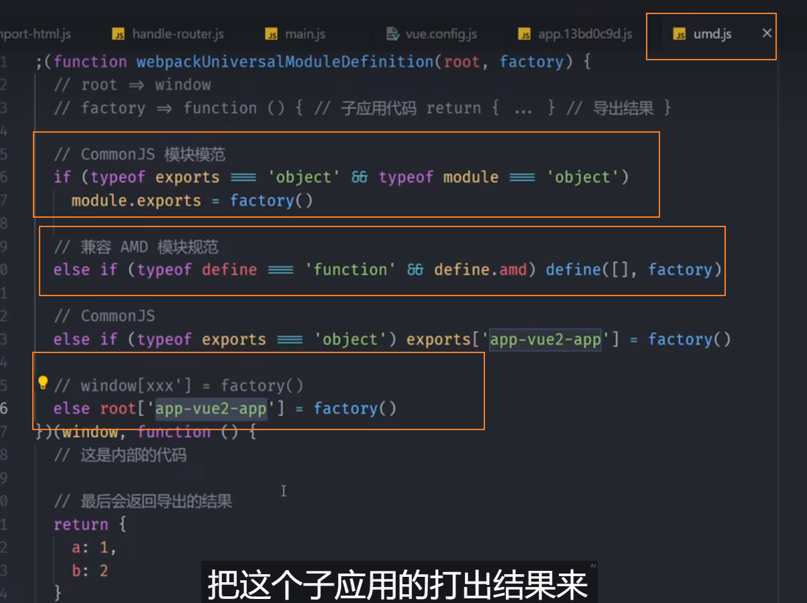

## 简单了解微前端

>微前端是一种多个团队通过独立发布功能的方式来共同构建现代化 web 应用的技术手段及方法策略。

微前端具备以下特点：

- 技术栈无关：主框架不限制接入应用的技术栈，微应用具备完全自主权
- 独立开发、独立部署：既可以组合在一起运行，也可以单独运行。
- 增量升级：在面对各种复杂场景时，我们通常很难对一个已经存在的系统做全量的技术栈升级或重构，而微前端是一种非常好的实施渐进式重构的手段和策略
- 独立运行时：每个微应用之间状态隔离，运行时状态不共享

以上为 qiankun 官网对微前端的概括

## 快速上手

这里以 vue2.x + qiankun  为例

我们先用 vue-cli快速创建一个项目，作为主应用，这里把他取名为 main-app

```sh
vue create main-app
```
为跟实际项目更接近，我们暂时手动选择了安装这些


项目创建完后，我们把 main-app 复制一份作为子应用，改名为 sub-app，现在我们有了 main-app 主应用和 sub-app 子应用。

好的，基本的准备工作已经完成，我们开始基于刚刚创建的两个项目改造成微前端应用

在 main-app 中，安装 qiankun：

```sh
yarn add qiankun # 或者 npm i qiankun -S
```

目录 src 下新建 ```src/qiankun/index.js```

注册微应用并启动，代码如下：

```js
import { registerMicroApps, start } from "qiankun";
import store from "@/store";


registerMicroApps([
  {
    name: "sub-vue",
    entry: "http://localhost:7663", // 微应用入口
    container: "#subapp-viewport", // 微应用挂载的div
    activeRule: "/sub-app/",
    props: {
      // 此处将父应用的 store 传入子应用
      store
    }
  }
]);

export default start;
```

这里我们把微应用的路由前缀定义为 ```sub-app```

views 目录下新建一个组件 ```src/views/qiankun/index.vue```,我们提供一个 id 为 subapp-viewport 的容器 DOM 供子应用挂载

```vue
<template>
  <div id="subapp-viewport"></div>
</template>

<script>
import start from "@/qiankun/index";
export default {
  mounted() {
    // 启动微前端
    if (!window.qiankunStarted) {
      window.qiankunStarted = true;
      start();
    }
  }
};
</script>
```

找到路由文件夹，```router/index.js```下加入如下路由，用以匹配微应用 
```js
{
  path: "/sub-app/*",
  meta: { title: "子应用" },
  component: () => import("@/views/qiankun/index")
}
```

### 微应用

上面我们对主应用的改造基本完成，接下来我们对之前复制出来的 sub-app 稍加改造，使其成为微应用


先找到 ```/src/router/index.js``` ,对路由文件稍加改造

删除 
```js
const router = new VueRouter({
  mode: "history",
  base: process.env.BASE_URL,
  routes
});

export default router;
```

于文件最后添加 
```js
export default routes;
```
找到```main.js```

将 ```import router from './router'``` 修改为 ```import routes from './routes'``` ,并增加 ```import VueRouter from "vue-router";```， 这里我们把主子应用路由都设置为 history 模式。

删除：
```js
new Vue({
  router,
  store,
  render: h => h(App)
}).$mount("#app");
```
增加 

```js
let router = null;
let instance = null;

if (window.__POWERED_BY_QIANKUN__) {
  // eslint-disable-next-line
  __webpack_public_path__ = window.__INJECTED_PUBLIC_PATH_BY_QIANKUN__
}

function render(props = {}) {
  const { container } = props;
  router = new VueRouter({
    base: window.__POWERED_BY_QIANKUN__ ? "/sub-vue/" : "/", // 抛出路由加前缀
    mode: "history",
    routes
  });

  instance = new Vue({
    router,
    store,
    render: h => h(App)
  }).$mount(container ? container.querySelector("#app") : "#app");
}

if (!window.__POWERED_BY_QIANKUN__) {
  render();
}
export default instance;

export async function bootstrap() {
  console.log("[vue] vue app bootstraped");
}

export async function mount(props) {
  // props 包含主应用传递的参数  也包括为子应用 创建的节点信息
  console.log("[vue] props from main framework", props);
  render(props);
}

export async function unmount() {
  instance.$destroy();
  instance = null;
  router = null;
}
```

最终 main.js 文件修改如下

```js
// main.js
import Vue from "vue";
import App from "./App.vue";
import routes from "./router";
import store from "./store";
import VueRouter from "vue-router";

Vue.config.productionTip = false;
// new Vue({
//   router,
//   store,
//   render: h => h(App)
// }).$mount('#app')

// 微前端 - 子应用配置
let router = null;
let instance = null;

if (window.__POWERED_BY_QIANKUN__) {
  // eslint-disable-next-line
  __webpack_public_path__ = window.__INJECTED_PUBLIC_PATH_BY_QIANKUN__
}

function render(props = {}) {
  const { container } = props;
  router = new VueRouter({
    base: window.__POWERED_BY_QIANKUN__ ? "/sub-vue/" : "/", // 抛出路由加前缀
    mode: "history",
    routes
  });


  instance = new Vue({
    router,
    store,
    render: h => h(App)
  }).$mount(container ? container.querySelector("#app") : "#app");
}

if (!window.__POWERED_BY_QIANKUN__) {
  render();
}
export default instance;

export async function bootstrap() {
  console.log("[vue] vue app bootstraped");
}

export async function mount(props) {
  // props 包含主应用传递的参数  也包括为子应用 创建的节点信息
  render(props);
}

export async function unmount() {
  instance.$destroy();
  instance.$el.innerHTML = '';
  instance = null;
}
```

在 sub-app 下新建 ```vue.config.js``` ,增加配置如下

```js
const { name } = require('./package.json')

module.exports = {
  publicPath: '/', // 打包相对路径
  devServer: {
    port: 7663, // 运行端口号
    headers: {
      'Access-Control-Allow-Origin': '*' // 防止加载时跨域
    }
  },
  chainWebpack: config => config.resolve.symlinks(false),
  configureWebpack: {
    output: {
      library: `${name}-[name]`,
      libraryTarget: 'umd', // 把微应用打包成 umd 库格式
      jsonpFunction: `webpackJsonp_${name}`
    }
  }
}
```
umd 格式包

UMD(统一模块定义)：这种模块语法会自动监测开发人员使用的是 Common.js/AMD/import/export 种的哪种方式，然后再针对各自的语法进行导出，这种方式可以兼容所有其他的模块定义方法。



最后我们在微应用新建一个测试页面以供嵌入主应用，路由暂且取名 ```/test```

```vue
// views/sub-app/index.vue
<template>
  <div class="sub-app">
    我是子应用
  </div>
</template>

<style lang="scss" scoped>
.sub-app {
  cursor: pointer;
  background-color: aqua;
}
</style>
```

至此，我们对主应用和微应用的改造基本完成，接下来我们测试一下，我们在主应用的 ```app.vue```添加一个按钮，使其点击的时候添加事件 ```this.$router.push('/sub-vue/test')``` 跳转至子应用


当我们点击按钮后,可以看到，微应用嵌入成功


这里我们主子应用都采用了同一套技术栈，是因为在公司项目中我们也是这样做的，相同的技术栈可以实现公共依赖库、UI库等抽离，减少资源开销，提升加载速度，最重要的是：“减少冲突的最好方式就是统一”，通过约束技术栈可以尽可能的减少项目之间的冲突，减少工作量与维护成本。

## 微前端常见问题


### 主子应用样式相互影响

各个应用样式隔离
这个问题乾坤框架做了一定的处理，在运行时有一个sandbox的参数，默认情况下沙箱可以确保单实例场景子应用之间的样式隔离，但是无法确保主应用跟子应用、或者多实例场景的子应用样式隔离。如果要解决主应用和子应用的样式问题，目前有2种方式：

在乾坤种配置 { strictStyleIsolation: true } 时表示开启严格的样式隔离模式。这种模式下 qiankun 会为每个微应用的容器包裹上一个 shadow dom 节点，从而确保微应用的样式不会对全局造成影响。但是基于 ShadowDOM 的严格样式隔离并不是一个可以无脑使用的方案，大部分情况下都需要接入应用做一些适配后才能正常在 ShadowDOM 中运行起来，这个在 qiankun 的 issue 里面有一些讨论和使用经验。
人为用 css 前缀来隔离开主应用和子应用，在组件层面用 css scoped进行组件层面的样式区分，在 css框架层面可以给css组件库加上不同的前缀，比如文档中的 antd 例子：
配置 webpack 修改 less 变量
```js
{
  loader: 'less-loader',
+ options: {
+   modifyVars: {
+     '@ant-prefix': 'yourPrefix',
+   },
+   javascriptEnabled: true,
+ },
}
```
b. 配置 antd ConfigProvider

```js
import { ConfigProvider } from 'antd';
   
export const MyApp = () => (
  <ConfigProvider prefixCls="yourPrefix">
    <App />
  </ConfigProvider>
);
```

## 应用间通信

- 1、localStorage/sessionStorage
- 2、通过路由参数共享
- 3、官方提供的 props
- 4、官方提供的 actions
- 5、使用vuex或redux管理状态，通过shared分享

具体实现参考这篇文章 [qiankun的五种通信方式](https://blog.csdn.net/weixin_43972437/article/details/128154083)

## qiankun 实现 keep-alive 需求

子项目 keep-alive 其实就是想在子项目切换时不卸载掉，仅仅是样式上的隐藏（display: none），这样下次打开就会更快。

但是 keep-alive 需要谨慎使用，同时加载并运行多个子项目，这将会增加 js/css 污染的风险。

产品那边其实当时是有提出这个需求的，当时第一时间想到的是借助 qiankun 的 loadMicroApp 函数来手动加载和卸载子应用。但是公司的项目主应用嵌入了十几个子应用，想到需要一个个处理，以及手动加载和卸载子应用所可能带来的一些边界问题处理，后面直接说这个需求不好实现。之后也就暂时搁置了


具体解决方案可以看 [qiankun issues](https://github.com/umijs/qiankun/issues/361) 里所给出的

### 路由跳转问题

在子应用中是没有办法通过 ```<router-link>``` 或者用 ```router.push/router.replace``` 直接跳转的，因为这个 router 是子项目的路由，所有的跳转都会基于子项目的 base 。当然了写 ```<a>``` 链接可以跳转过去，但是会刷新页面，用户体验并不好。

- 将主应用的路由实例通过 props 传给微应用，微应用这个路由实例跳转。
- history 模式时，通过 history.pushState() 方式跳转

这里我把他封装为了一个常用方法

```js
/**
 * 微前端子应用路由跳转
 * @param {String} url 路由
 * @param {Object} mainRouter 主应用路由实例
 * @param {*} params 状态对象：传给目标路由的信息,可为空
 */

const qiankunJump = (url, mainRouter, params) => {
  if (mainRouter) {
    // 使用主应用路由实例跳转
    mainRouter.push({ path: url, query: params })
    return
  }
  // 未传递主应用路由实例，传统方式跳转
  let searchParams = '?'
  let targetUrl = url
  if (typeOf(params) === 'object' && Object.keys(params).length) {
    Object.keys(params).forEach(item => {
      searchParams += `${item}=${params[item]}&`
    })
    targetUrl = targetUrl + searchParams.slice(0, searchParams.length - 1)
  }
  window.history.pushState(null, '', targetUrl)
}
```

### qiankun+vue 适配vue-pdf踩坑

找到vue-pdf的依赖包下的vuePdfNoSss.vue

```vue
//找到vue-pdf的依赖包下的vuePdfNoSss.vue
<style src="./annotationLayer.css"></style>
<script>
	import componentFactory from './componentFactory.js'
	if ( process.env.VUE_ENV !== 'server' ) {
		var pdfjsWrapper = require('./pdfjsWrapper.js').default;
		var PDFJS = require('pdfjs-dist/es5/build/pdf.js');
		if ( typeof window !== 'undefined' && 'Worker' in window && navigator.appVersion.indexOf('MSIE 10') === -1 ) {
      // 注释原本的引入方法
			// var PdfjsWorker = require('worker-loader!pdfjs-dist/es5/build/pdf.worker.js');
			  var PdfjsWorker=require('pdfjs-dist/es5/build/pdf.worker.js');
			PDFJS.GlobalWorkerOptions.workerPort = new PdfjsWorker();
		}
		var component = componentFactory(pdfjsWrapper(PDFJS));
	} else {
		var component = componentFactory({});
	}
	export default component;
</script>
```

修改项目的配置文件vue.config.js

```js
chainWebpack: (config) => {
  config.module
    .rule('worker')
    .test(/\.worker\.js$/)
    .use('worker-loader').loader('worker-loader')
    .options({
      inline: true,
      fallback: false
    }).end();
}
```

### 主项目和子项目部署到一起，子项目部署到二级目录(不占用这么多端口)

因为客户方的要求，可能有时候不允许服务器开太多的端口，因此需要把主应用和微应用部署到一起，公用一个端口。

[主项目和子项目部署到一起，子项目部署到二级目录](https://github.com/umijs/qiankun/issues/400#issuecomment-676947927)

### qiankun在子应用中引入百度地图时报错解决

修改主应用 start 方法

```js
// 启动微前端
if (!window.qiankunStarted) {
  window.qiankunStarted = true
  start({
    singular: false,
    excludeAssetFilter: (assetUrl) => {
      // 过滤baidu
      const wihiteWords = ['baidu']
      if (wihiteWords.includes(assetUrl)) {
        return true
      }
      return wihiteWords.some(w => {
        return assetUrl.includes(w)
      })
    }
  })
}
```

其他一些常见问题可见于 [qiankun官网](https://qiankun.umijs.org/zh/faq)

总的来说，微前端确实解决了一些项目中的痛点，但是切记微前端不是银弹，老旧项目带来的迁移成本，不同技术栈的兼容与边界问题处理，因为没有迫切的需求要接入微前端，只会带来额外的负担，很多时候，iframe 其实就很够用了。

参考：
[万字长文-落地微前端 qiankun 理论与实践指北](https://juejin.cn/post/7069566144750813197)

[qiankun 微前端实践总结](https://juejin.cn/post/6856569463950639117)


## 往期回顾
[vue3 正式发布两年后，我才开始学 — vue3+setup+ts 🔥](https://juejin.cn/post/7158331832512020511)
<br>
[2022年了，我才开始学 typescript ，晚吗？（7.5k字总结）](https://juejin.cn/post/7124117404187099172)
<br>
[当我们对组件二次封装时我们在封装什么](https://juejin.cn/post/7127925414885851144)
<br>
[vue 项目开发，我遇到了这些问题](https://juejin.cn/post/7119018849353072677)
<br>
[关于首屏优化，我做了哪些](https://juejin.cn/post/7117515006714839047)

